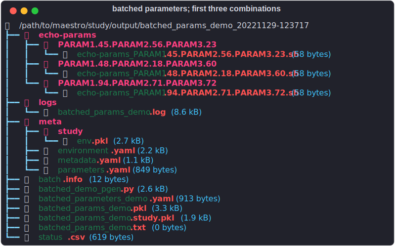

# How-to Guides
---

These guides are intended to be used as recipes for solving common problems with Maestro.  It is recommended that you go through the [tutorials](tutorials.md) first if you are new to using Maestro.

## Processing large numbers of parameters in batches
---

Scaling up the numbers of parameter combinations in studies can run into a few road blocks:

* **File system overloading**

    The current version of Maestro builds a single level tree in the step workspaces, with parameter combinations expanded flatly under the step root.  This design can slow down other file system operations such as `rm` and `ls`, with impacts varying with specific file systems.
    
    Additionally, there are inode and disk space limits (or potentially per user quotas on shared systems) that when hit can bring a study to a halt until things are cleaned up.
    
* **HPC scheduler overloading**

    Some HPC schedulers can run into scaling issues with large studies as most of the [script/scheduler adapters](scheduling.md) treat each instance of a step (one parameter combination applied to a step) as discrete batch jobs.  Thus naively launching studies with thousands or more parameter combinations can quickly swamp the scheduler.
    
    There are a few solutions to this problem depending on the specific study, including use of the `throttle` argument to the run command to limit the number of jobs to submit to the scheduler queue, or if jobs are quick running and/or small, use the [flux](scheduling.md#flux) adapter to pack many jobs into an allocation.  However, this still leaves open the issue of swamping the file system.


An alternative that can be used to address both concerns is to insert gaps in the execution by processing large numbers of parameter sets in batches across multiple studies.  This batched execution allows cleanup of each batch's outputs before the next begins, freeing up precious file system space and avoiding deadlocks when that space/quota is reached.  As a simple model problem we will use [`pgen`](parameter_specification.md#parameter-generator-pgen) to provide command line control of the number of parameters to read out of a csv file in each executed study in this batched execution option.  

!!! note

    This can also use data sources other than csv, including networked sources such as a database with minimal changes.


### Generating the parameter set
---

This example will be working with the following set of parameters found in the `params.csv` file
in the batched\_parameters samples folder.  The parameter set was generated using the `csv_generator.py` included here (and in the samples folder), facilitating experiments with alternate
parameter naming/counts.  In this example there's an index column `param_combo`, which gets ignored
in the `pgen` calls later on.  The csv file is all lower cased, but the Maestro tokens are uppercased
to make them distinct in the study specification as shown inside the brackets (`[ ]`) in the column names below.

<!-- add link to github's samples/how_to_guide/batched_parameters folder in here -->
=== "params.csv"
    <!-- NOTE: make a custom superfence for reading these in later -->
    
    | param\_combo  | param1 [`$(PARAM1)`]  | param2 [`$(PARAM2)`]  | param3 [`$(PARAM3)`]  |
    |:--|:--|:--|:--|
    |  0  | 94  | 71  | 72  |
    |  1  | 48  | 18  | 60  |
    |  2  | 45  | 56  | 23  |
    |  3  |  0  | 30  | 95  |
    |  4  | 77  |  8  | 34  |
    |  5  | 99  | 44  | 99  |
    |  6  | 19  | 62  | 52  |
    |  7  | 89  | 14  | 26  |
    |  8  | 82  |  6  | 24  |
    |  9  | 32  | 80  | 83  |
    | 10  | 68  | 58  | 65  |
    | 11  | 13  | 45  | 13  |
    | 12  | 65  | 99  | 70  |
    | 13  | 44  | 94  | 86  |
    | 14  | 50  | 35  | 50  |
    | 15  | 89  | 53  | 65  |
    | 16  | 28  | 97  | 47  |
    | 17  | 98  | 93  | 86  |
    | 18  | 24  | 17  | 97  |
    | 19  | 39  | 50  | 83  |
    
=== "csv_generator.py"

    ``` python
    --8<-- "samples/how_to_guide/batched_parameters/csv_generator.py"
    ```

### Study specification
---

The sample specification for this is a very simple single step study that echoe's the input parameters and their
values.

<!-- Expand to templated version -> csv generator also populates this template to ensure param names match up? -->

``` yaml
--8<-- "samples/how_to_guide/batched_parameters/batched_parameters_demo.yaml"

```

### Running a subset of parameters
---

All of the control of which parameters get run in a given study go through [`pgen` via it's `pagrgs`](parameter_specification.md#pgen-arguments-pargs).  The `batched_demo_pgen.py` custom generator has 5 available pargs that control the csv parsing and parameter outputs:

* `CSV`: name/path of csv file to read parameters from

* `NROWS`: number of parameter sets/combinations to read in for this instance of the study

* `START`: optional row offset to start reading parameters from (i.e. for additional instances of the study)

* `INDEX`: optional name of the index column.  This column is not treated as a parameter to be used in the study. 

* `DEBUG`: optional flag to add debugging output during study initialization.  If any string is added here then the pgen will print out all parameter names and values read from the csv file.


``` python
--8<-- "samples/how_to_guide/batched_parameters/batched_demo_pgen.py"
```

Running an instance with the first 3 rows of parameter combos from the csv is as simple as:

``` console
maestro run --dry batched_parameters_demo.yaml --pgen batched_demo_pgen.py --pargs "INDEX:param_combo" --pargs "CSV:params.csv" --pargs "DEBUG:true" --pargs "NROWS:3"
```

We can then verify the workspace is as expected, with three directories under the `echo-params` step for the three parameter combintations selected from the csv input



### Next steps
---

The next step in this 'how-to' is left up to the reader.  At this point we have a study and parameter generator that can be used to process large numbers of parameter combinations in batches.  Managing the disk-space/inode concerns can now be addressed between parameter batches.  Potential options could include:

* Extracting the necessary data and uploading into an external database, either offline or as subsequent steps in the study executed by Maestro directly. The entire study workspace can then be deleted upon success (what determines success being highly workflow dependent)

* Tar up the outputs.  This could be as simple as tarring up the whole Maestro study workspace for later processing, or more targetting tarring of each step's outputs to compress the contents of each step/parameter workspace to a single file to conserve inodes by deleting the originals.

* Archive the outputs to some other file system, either with or without tarring

* ...


## Controlling step states
---

Return codes emitted by the bash scripts/commands defininig a step are the primary mechanism for determining the final state of a job.  Controlling/manipulating these return codes can be crucial to ensuring a study can actually execute successfully.  A few special cases where you want to pay attention to this are:

* Running a simulation which is known to crash at some point, but that point is beyond the successful data collection window.  This case would normally end up with a failed state from Maestro's point of view, disabling execution of any subsequent steps.

* Running a long running task that can itself talk to the scheduler and turn on 'gracetime' style restart checkpoints shortly before the scheduled job times out to enable more optimial restart behavior (spend less time recomputing as can happen with pre-scheduled restart checkpoint dumps).  This case would end up with a success state from Maestro's point of view instead of the expected time out, thus leaving the step in an actually unfinished state despite the status saying otherwise.

=== "Override Failed Return Code"

    In this case there's a few simple options shown in the sample specification below
    
    1.  Parse the logs and/or examine the outputs and mark successful if the right data was collected
    
    2.  Run any shell command that itself returns a success code
        
    ``` yaml hl_lines="19-21 23-24"
    study:
    - name: stage
      description: copy in input/processing files to isolate them to this study
      run:
        cmd: |
          cp $(SPECROOT)/$(INPUT_FILE) .
          cp $(SPECROOT)/$(POST_PROC_TOOL) .
          # insert other setup junk..
         
    - name: sim-run
      description: run the simulation
      run:
        cmd: |
            # Get the input file
            cp $(stage.workspace)/$(INPUT_FILE) .
           
            $(LAUNCHER) $(SIM_EXECUTABLE) -in $(INPUT_FILE)
 
            # run subsequent command to give success return code
            #   e.g. parse logs/outputs
            $(POST_PROC_TOOL) --validate-outputs  # (1)
            
            #   or simply run an echo or other simple shell command
            echo "Job finished successfully"  # (2)
 
        restart: |
            # OMIT THE SETUP CODE/COPYING/ETC
            # also change the invocation if needing to pass a specific restart
            # checkpoint (not shown)
            
            $(LAUNCHER) $(SIM_EXECUTABLE) -in $(INPUT_FILE)
 
 
        procs: $(PROCS)
        walltime: "30:00"
        depends: [stage]
    ```
    

=== "Force a Timeout"

    This solution is very similar, with the primary difference being that the extra command run in the step after the long running simulation/calculation is a simple sleep type operation that runs for long enough to ensure the scheduler has to interrupt it and thus signal to Maestro that a timeout occurred.  Here we're using the simple sleep shell command with a fixed time.  You may want to embed more logic here to determine the required sleep time if it's not known in advance.  An additional safeguard is used here: a post processing tool `$(POST_PROC_TOOL)` is run first to check for gracetime dumps, returning standard error codes, with `0` being used here to say 'yes, gracetime found, go to sleep'.  This retcode then used to switch between sleeping and exiting in an error state to avoid unnecessary restarts if the job actually failed.  This is replicated in the restart script as well to ensure multiple attempts work as expected.  
    
    !!! note 
    
        Any errors in the `$(POST_PROC_TOOL)` will also abort the run as the conditional will correctly detect that based on it's non-zero return code.
    
    ``` yaml hl_lines="19-29 38-48"
    study:
    - name: stage
      description: copy in input/processing files to isolate them to this study
      run:
        cmd: |
          cp $(SPECROOT)/$(INPUT_FILE) .
          cp $(SPECROOT)/$(POST_PROC_TOOL) .
          # insert other setup junk..
         
    - name: sim-run
      description: run the simulation
      run:
        cmd: |
            # Get the input file
            cp $(stage.workspace)/$(INPUT_FILE) .
           
            $(LAUNCHER) $(SIM_EXECUTABLE) -in $(INPUT_FILE)
 
            # Run subsequent commands to check for/force timeout
            #   parse logs/outputs to verify a gracetime occurred
            $(POST_PROC_TOOL) --check-gracetime
            
            if [ $? = 0 ] then
              #  sleep for some amount of time that ensures scheduler will interrupt this
              sleep 3600
            else
              #  error found instead of gracetime, mark failed
              exit 1
            fi
 
        restart: |
            # OMIT THE SETUP CODE/COPYING/ETC
            # also change the invocation if needing to pass a specific restart
            # checkpoint (not shown)

            $(LAUNCHER) $(SIM_EXECUTABLE) -in $(INPUT_FILE)

            # Run subsequent commands to check for/force timeout
            #   parse logs/outputs to verify a gracetime occurred
            $(POST_PROC_TOOL) --check-gracetime
            
            if [ $? = 0 ] then
              #  sleep for some amount of time that ensures scheduler will interrupt this
              sleep 3600
            else
              #  error found instead of gracetime, mark failed
              exit 1
            fi
            
        procs: $(PROCS)
        walltime: "30:00"
        depends: [stage]
    ```

