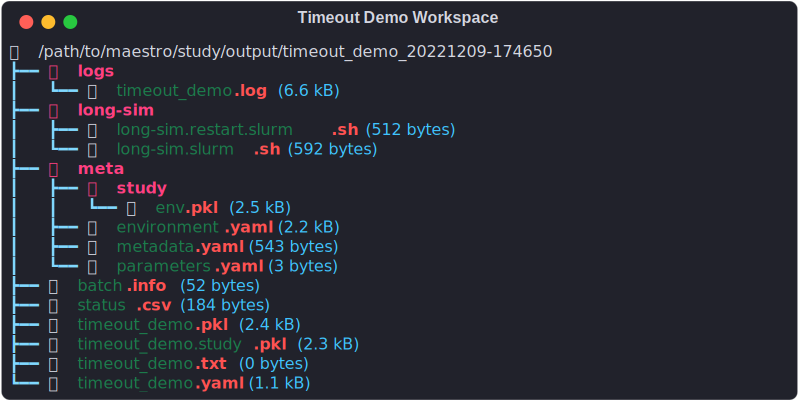

# Long running jobs and managing timeouts
---

HPC scheduling systems often hard time limits on any jobs submitted to them.  A common feature of these schedulers is marking a job with a 'timeout' state if it has to interrupt a process to terminate the job.  Maestro has built-in facilities for handling this and helping users to automate the resubmission process to continue long running processes beyond this time limit: the optional `restart` block available in the steps in the study specification (see [`run`](../specification.md#run)).  This `restart` block behaves exactly like the `cmd` block, but it is called out separately so that you can customize the commands to more smoothly restart: e.g. leave out the setup code for copying required files into the workspace since they are already there.

``` yaml title="timeout_demo.yaml"
description:
    name: timeout_demo
    description: A non-functional study for demonstrating use of restart block

batch:
  type: slurm
  host: quartz
  bank: baasic
  queue: pdebug
  

env:
    variables:
        OUTPUT_PATH: ./samples/timeout_demo
        SIM_EXECUTABLE: path/to/best_sim_tool
        SIM_INPUT: best_sim_input_config.yaml

study:
    - name: long-sim
      description: Dummy step that shows a long-running simulation with restart
      run:
          cmd: |
            # Setup the workspace
            cp $(SPECROOT)/$(SIM_INPUT) .

            # Start the sim and drop checkpoints ever 30 seconds
            $(LAUNCHER) $(SIM_EXECUTABLE) --input $(SIM_INPUT) --checkpoint-freq 30 --checkpoint-name LONG_SIM
            
          restart: |
            # Can skip the setup steps here as the input config is already here

            # Restart from the last checkpoint found
            $(LAUNCHER) $(SIM_EXECUTABLE) --input $(SIM_INPUT) --checkpoint-name LONG_SIM --checkpoint latest

          procs: 64
          nodes: 1
          walltime: "00:10:00"
```

Additional control of this process is found on the command line with the `rlimit` argument to the [`run`](../cli.md#run) command telling Maestro how many times to submit restarts when it recieves the timeout signal from the scheduler before giving up.

``` console title="Run timeout_demo study and attempt 3 retries upon timeout"
maestro run timeout_demo.yaml --rlimit 3
```

!!! note

    The `rlimit` setting is currently only available on the command line and is applied globally to all steps in the study.
    
Another detail of enabling this feature is there will be an additional batch/shell script generated in the workspace with the 'restart' part in it as shown below in the dry-run outputs of the example specification.  When Maestro resubmits a job due to the timeout signal being recieved it uses the script with the 'restart' part in it.



!!! warning

    This restart capability is only going to be useful if the process you are automating has the capability to save a checkpoint and restart from that.  Without that you will simply be wasting cycles recomputing the same thing over and over again withough getting any further in time.
    
    
