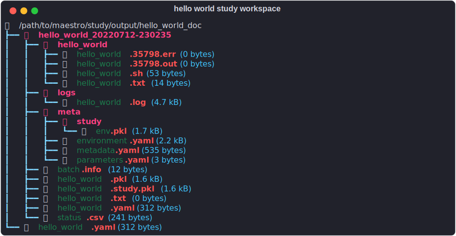

## What is Maestro?

Maestro is an open-source HPC software tool that defines a YAML-based study specification for defining multistep workflows and automates execution of software flows on HPC resources. The core design tenants of Maestro focus on encouraging clear workflow communication and documentation, while making consistent execution easier to allow users to focus on science. Maestro's study specification helps users think about complex workflows in a step-wise, intent-oriented, manner that encourages modularity and tool reuse. These principles are becoming increasingly important as computational science is continuously more present in scientific fields and has started to require a similar rigor to physical experiment. Maestro is currently in use for multiple projects at Lawrence Livermore National Laboratory and has been used to run existing codes including MFEM, and other simulation codes. It has also been used in other areas including in the training of machine-learned models and more.

----------------

## Getting Started is Quick and Easy

Create a `YAML` file named `study.yaml` and paste the following content into the file:

``` yaml
description:
    name: hello_world
    description: A simple 'Hello World' study.

study:
    - name: say-hello
      description: Say hello to the world!
      run:
          cmd: |
            echo "Hello, World!" > hello_world.txt
```

> *PHILOSOPHY*: Maestro believes in the principle of a clearly defined process, specified as a list of tasks, that are self-documenting and clear in their intent.

Running the `hello_world` study is as simple as...

    maestro run study.yaml
    
Doing so will generate your hello_world.txt in an isolated workspace next to your study.yaml workflow specification:




## Creating a Parameter Study is just as Easy

With the addition of the `global.parameters` block, and a few simple tweaks to your `study` block, the complete specification should look like this:

``` yaml
description:
    name: hello_planet
    description: A simple study to say hello to planets (and Pluto)

study:
    - name: say-hello
      description: Say hello to a planet!
      run:
          cmd: |
            echo "Hello, $(PLANET)!" > hello_$(PLANET).txt

global.parameters:
    PLANET:
        values: [Mercury, Venus, Earth, Mars, Jupiter, Saturn, Uranus, Neptune, Pluto]
        label: PLANET.%%
```

> *PHILOSOPHY*: Maestro believes that a workflow should be easily parameterized with minimal modifications to the core process.

Maestro will automatically expand each parameter into its own isolated workspace, generate a script for each parameter, and automatically monitor execution of each task.

And, running the study is still as simple as:

``` bash
    maestro run study.yaml
```

Doing so will generate many `hello_planet.txt` files in an isolated workspace next to this `hello_planet.yaml` workflow specification:


Continue on to the [tutorials](#tutorials) and [how-to-guides](#how_to_guides) to continue layering on all of the available features including multi-step workflows, scheduling studies on HPC clusters, custom parameter generation facilities.  For a complete overview of the yaml specification see [Specification](specification.md).  See [Specifying Study Parameters](#parameter_specification.md) for a thorough discussion of how to tell Maestro what parameter sets to apply to your study.
