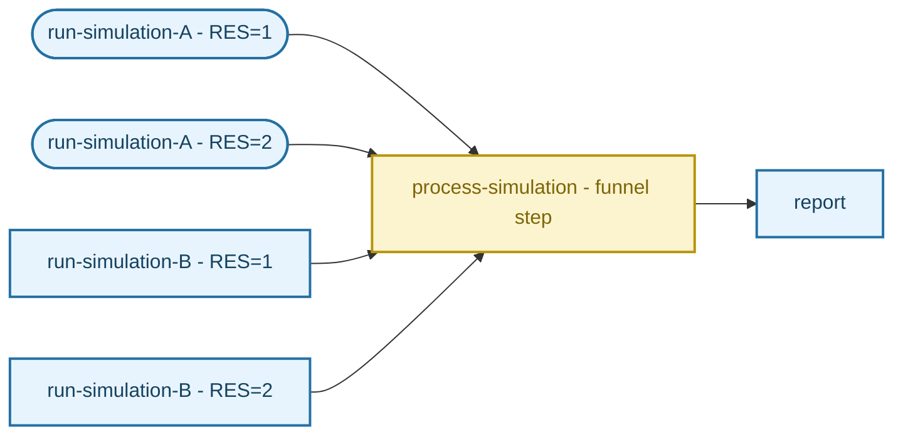
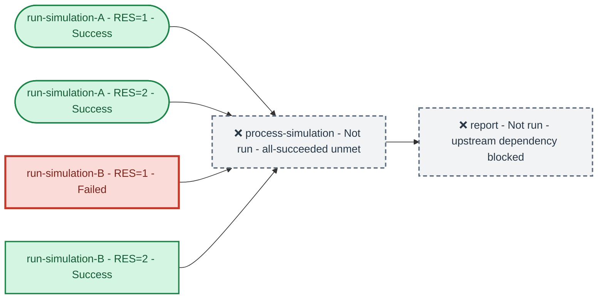
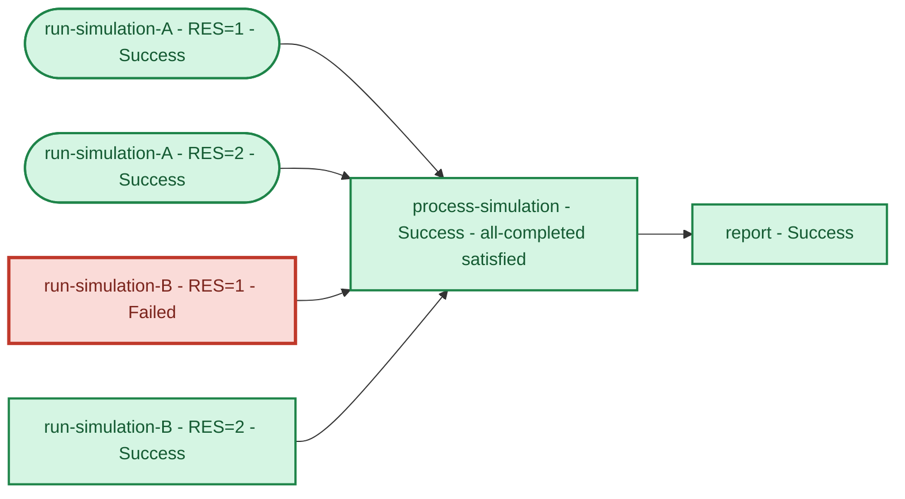
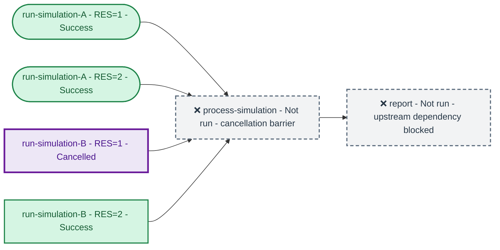

# MEP 004 - Step Dependency Execution Policy

## Abstract

Maestro step execution policies are currently hardwired to successful/unsuccessful step states, which are themselves tightly coupled to the states returned by the scheduler.  User control over this is limited to presence of a `restart` block in a step to take advantage of Timeout states, or manipulating the return state/exit code of the step scripts themselves to affect the state reported by the scheduler as detailed in the how-to-guides here [INSERT LINK].  Multiple mechanisms are needed to enhance this capability and move towards a decoupling of the workflow state from the scheduler and step task states.  This proposal details a hook in the study specification to set an execution policy on a per step basis.  This is intentionally decoupled from the step/scheduler execution layers to better deal with cases where the how-to-guides' recipes [INSERT LINK] fail to execute due to OOM's, Hardware Failures, or other states that preclude complete execution of a study step.

The states that feed into this control mechanism are the 'final outcomes' of the state.  These final outcomes are divided
into two groups:


| **Final Outcome** | **States**  | **Meaning** |
| :---------------: | :---------: | :---------: |
| **COMPLETED**     | Success, Failed, Out of Memory, Hardware Failure, Timeout, Restart Limit Reached | Execution and restart processing have concluded. Completion does not imply success. |
| **CANCELLED**       | Cancelled   | Execution was cancelled and downstream execution is prohibited |


Restarts can still occur with this proposed mechanism, currently triggering on receipt of hardware failure and timeout states from the scheduler.  If the restart block is present in the step in question, restarts will be submitted until restart limit is reached, success, or failure.  When either restart limit or other completed outcome is reached, or the restart block is absent, timeout and hardware failure states are promoted to a completed outcome.

The proposed execution policy is simply stating what to do when parent steps have one of these final outcomes, signaling the step (and workflow) to either continue or stop.  Current maestro behavior will only execute children if their parent(s) have a Success state.  This new mechanism will optionally allow execution a step if any selected completed outcome is reached by its parent(s).  As `depends` is itself a condtion upon which to control the execution of a step, we propose naming this new control aspect, `condition`, with a limited set of scalar values in this intial implementation:

| **Condition** | **Semantics** |
| :-----------: | :-----------: |
| `all-succeeded` | Every parent must finish successfully.  This preserves current behavior and will be the default. |
| `all-completed` | Every parent must reach a non-cancelled final outcome. |

### Proposed syntax

The proposed syntax for this new capability in the study specification extends the depends key to allow mappings
for the value in addition to the current list shape.  The mapping retains the familiar topological constraint for
the list of step names defining it's parents (and the topology of the graph), and the new `condition` key here.

``` yaml linenums="1" hl_lines="21-22"
description:
  name: simple_study
  description: |
      Simple study used to demonstrate step dependency execution
      policy.

study:
  - name: run-simulation
    description: Step that executes a simulation
    run:
      cmd: |
        echo "Used Parameters: RES: $(RES)"

  - name: process-simulation
    description: Simple step that processes the outputs of a simulation
    run:
      cmd: |
        echo "Processing simulation in $(run-simulation.workspace)"

      depends:
        steps: [run-simulation]
        condition: all-completed

  - name: report
    description: Simple step that generates a report of processed data
    run:
      cmd: |
        echo "Generating report of processed simulation data in $(process-simulation)"

      depends:
        steps: [process-simulation]
        condition: all-completed

global.parameters:
  RES:
    values: [1, 2]
    labels: RES.%%
```

### Multiple conditions

#### Option 1

A simple extension using the syntax in `global.parameters` blocks would enable setting different conditions on different
steps for cases where a child has many parent steps where we allow the `all-completed` state for the `run-simulation-A`
step, but we want to require all instances of the `run-simulation-B` step to meet the more stringent `all-succeeded`
condition.

``` Yaml linenums="1" hl_lines="27-28"
description:
  name: simple_study
  description: |
      Simple study used to demonstrate step dependency execution
      policy.

study:
  - name: run-simulation-A
    description: Step that executes simulation-A
    run:
      cmd: |
        echo "Used Parameters: RES_A: $(RES_A)"

  - name: run-simulation-B
    description: Step that executes simulation-B
    run:
      cmd: |
        echo "Used Parameters: RES_B: $(RES_B)"

  - name: process-simulation
    description: Simple step that processes the outputs of a simulation
    run:
      cmd: |
        echo "Processing simulation in $(run-simulation.workspace)"

      depends:
        steps: [run-simulation-A, run-simulation-B]
        condition: [all-completed, all-succeeded]

  - name: report
    description: Simple step that generates a report of processed data
    run:
      cmd: |
        echo "Generating report of processed simulation data in $(process-simulation)"

      depends:
        steps: [process-simulation]
        condition: [all-completed]

global.parameters:
  RES_A:
    values: [1, 2]
    labels: RES.%%

  RES_B:
    values: [1, 2]
    labels: RES.%%
```

#### Option 2

This option may be more readable in cases where you have many parent steps; two parenst as shown here isn't too stressful,
but once the lists start wrapping in the editor it becomes more cumbersome to map the condition to the step.  This list
of mappings syntax change things slightly, using `step` instead of `steps`.

!!! note

    Could potentially mix the two by allowing each mapping to apply a condition to many steps, more like the single condition syntax?

``` Yaml linenums="1" hl_lines="28-31"
description:
  name: simple_study
  description: |
      Simple study used to demonstrate step dependency execution
      policy.

study:
  - name: run-simulation-A
    description: Step that executes simulation-A
    run:
      cmd: |
        echo "Used Parameters: RES_A: $(RES_A)"

  - name: run-simulation-B
    description: Step that executes simulation-B
    run:
      cmd: |
        echo "Used Parameters: RES_B: $(RES_B)"

  - name: process-simulation
    description: Simple step that processes the outputs of a simulation
    run:
      cmd: |
        echo "Processing simulations in $(run-simulation-A.workspace)"
        echo "Processing simulations in $(run-simulation-B.workspace)"

      depends:
        - step: run-simulation-A_*
          condition: all-completed
        - step: run-simulation-B_*
          condition: all-succeeded
          
  - name: report
    description: Simple step that generates a report of processed data
    run:
      cmd: |
        echo "Generating report of processed simulation data in $(process-simulation)"

      depends:
        - step: process-simulation
          condition: all-completed


global.parameters:
  RES_A:
    values: [1, 2]
    labels: RES.%%

  RES_B:
    values: [1, 2]
    labels: RES.%%
```

### Legacy syntax

``` yaml
depends: [run-simulation]   # run-simulation is parent step name
```

Equivalent normalized form:
``` yaml
depends:
  steps: [run-simulation]
  condition: all-succeeded
```
<!-- NOTE: add md linter to strip tabs from yaml code blocks -->

### State Semantics

| **Parent state after restart processing** | `all-succeeded` | `all-completed` |
| :---------------------------------------: | :-------------: | :-------------: |
| Success                                   | Satisfied       | Satisfied       |
| Failed                                    | Not satisfied   | Satisfied       |
| Out of Memory                             | Not satisfied   | Satisfied       |
| Hardware Failure                          | Not satisfied   | Satisfied       |
| Timeout                                   | Not satisfied   | Satisfied       |
| Restart Limit Reached                     | Not satisfied   | Satisfied       |
| Cancelled                                 | Not satisfied   | Not satisfied   |
| Running or restart pending                | Wait            | Wait            |

Hardware Failure and Timeout are not considered completed until no further restarts can be scheduled.

### Application to various topologies

#### Workflow topology

Topology of our sample study, unexecuted



#### `all-succeeded`, one parent fails

This scenario applies `all-succeeded` conditions to both simulation steps, and shows execution states
if one of those parents fails.



#### `all-completed`, one parent fails

This scenario applies `all-completed` conditions to both simulation steps, and shows execution states
if one of those parents fails.



#### `all-completed`, one parent is cancelled

This scenario applies `all-completed` conditions to both simulation steps, and shows execution states
if one of those parents is cancelled.  Note that in this case, the outcome would be the same using 
the `all-succeeded` conditions as cancellation is the one state that will halt execution in both proposed
conditions.



