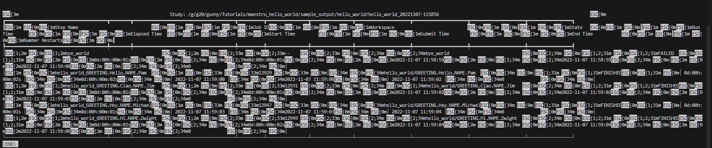
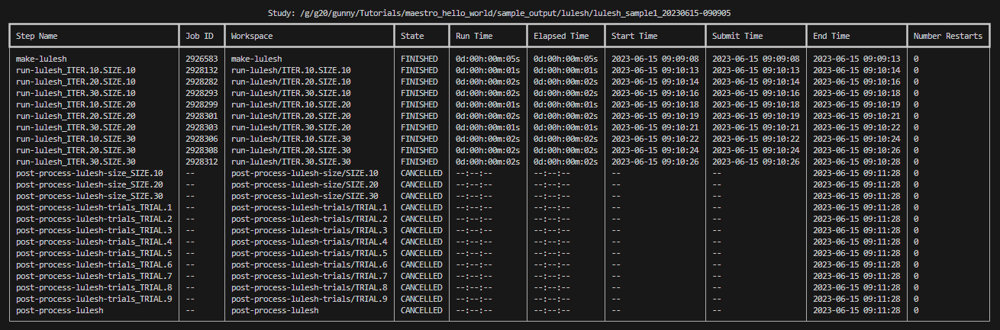
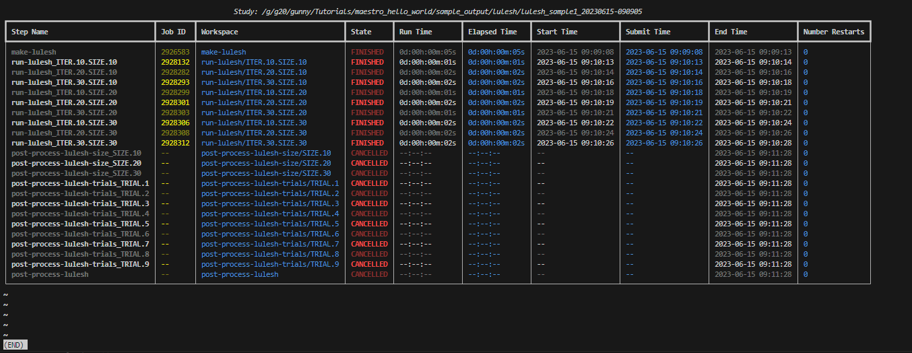
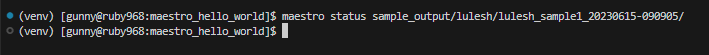
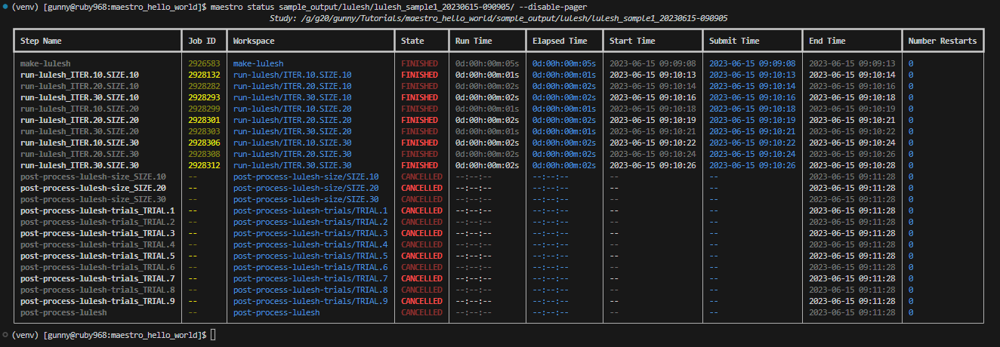

## Getting a Live Study to Inspect
---

First you'll need a running/completed study to monitor.  Either grab one from the [Tutorials](tutorials.md) or one of the variants of the [Lulesh](specification.md#full-example) examples that we'll be showing below.  Additionaly, see the tutorials if needed for a refresher on how to run a study.

!!! note
  
    The `samples` directory in the project repo contains these examples as well


## Monitoring a Running Study
---

Once the conductor is spun up, you will be returned to the command line prompt. There should now be a ``./tests/lulesh`` directory within the root of the repository. This directory represents the executing study's workspace, or where Maestro will place this study's data, logs, and state. For a more in-depth description of the contents of a workspace see the 'outputs' sections in the examples in the [Tutorials](tutorials.md) and the more exhaustive documentation on [Study Workspaces](study_workspaces.md)

!!! bug

    Study workspaces section not written yet

In order to check the status of a running study, use the ``maestro status`` subcommand. The only required parameter to the status command is the path to the running study's workspace. In this case, to find the status of the running study (from the root of the repository) is:

``` console
$ maestro status ./tests/lulesh
```

The resulting output will look something like below:

<figure markdown>
  
  <figcaption>Flat layout view of status of an in progress study</figcaption>
</figure>

!!! note

    If the output of your study looks something like this:

    <figure markdown>
      
      <figcaption>Example of a theme error with the status output</figcaption>
    </figure>

    Then there are a couple things you can try to fix this problem:

    1. Set the MANPAGER or PAGER environment variable to be "less -r" (e.g. export MANPAGER="less -r") and run again

    2. If the error isn't fixed after 1. above, then:

        a. You can disable the theme with the ``--disable-theme`` option (see [Status Theme](#status-theme) below).

        b. If you'd rather not disable the theme, the error usually stems from using the pager functionality, so you can try disabling that with the ``--disable-pager`` option (see [Status Pager](#status-pager) below). <text class=caution>Caution:</text> you may end up outputting a lot of information to the terminal all at once when using this option.

To return to your terminal window, press `q` (see [Status Pager](#status-pager) below for more information).

The general statuses that are usually encountered are:

| Status | Description |
| ------ | ----------- |
| `INITIALIZED` | A step that has been generated and is awaiting execution. |
| `RUNNING` | A step that is currently in progress. |
| `FINISHED` | A step that has completed successfully. |
| `FAILED` | A step that during execution encountered a non-zero error code. |

  
## Canceled Study Status
---

Similar to checking the status of a running study, cancelling a study uses the ``maestro cancel`` subcommand with the only required parameter being the path to the study workspace. In the case of the LULESH study, cancel the study using the following command from the root of the repository:

``` console
$ maestro cancel ./tests/lulesh
```

!!! note

    Cancelling a study is not instantaneous. The background conductor is a daemon which spins up periodically, so cancellation occurs the next time the conductor returns from sleeping and sees that a cancel has been triggered.

When a study is cancelled, the cancellation is reflected in the status when calling the ``maestro status`` command

<figure markdown>
  
  <figcaption>Flat layout view of status of a cancelled study</figcaption>
</figure>


## Status Layouts
---

There are currently three layouts for viewing the status.  The default `flat` layout shown above can be a little hard to read in narrow terminals or in studies with long step/parameter combo names.  For this purpose a `narrow` layout has also been implemented,
compressing the width and making the status table taller.  Additionally, the extra room allows the addition of per step tables of parameter names and values.  To switch between these two simply use the `--layout` option with either `flat` or `narrow` as shown below:

``` console
$ maestro status ./tests/lulesh --layout narrow
```

A snippet of the narrow layout for the above study is shown below.  These layouts are computed by status command, so you can alternate between them in the same study without issue:

<figure markdown>
  
  <figcaption>Narrow layout view of status of a cancelled study</figcaption>
</figure>

Note these layouts read some colors from your terminal theme, including the background color, and thus may look different on your system.  The red for the state, yellow for jobid and the blue color on alternating columns are currently fixed. 

!!! note

    Snapshots can reproduced using the encom theme for iTerm2.

Finally, the original status layout is still available via the `legacy` option.  Note that this renderer can be difficult to read in narrow terminals and with studies having many parameters due to the lack of wrapping in columns.  An example from lulesh is shown below:

``` console
    Step Name                           Workspace            State      Run Time        Elapsed Time    Start Time                  Submit Time                 End Time                      Number Restarts
    ----------------------------------  -------------------  ---------  --------------  --------------  --------------------------  --------------------------  --------------------------  -----------------
    run-lulesh_ITER.20.SIZE.20          ITER.20.SIZE.20      FINISHED   0:00:00.238367  0:00:00.238549  2018-08-07 17:24:04.178433  2018-08-07 17:24:04.178251  2018-08-07 17:24:04.416800                  0
    post-process-lulesh                 post-process-lulesh  CANCELLED  --:--:--        --:--:--        --                          --                          2018-08-07 17:25:06.813454                  0
    post-process-lulesh-trials_TRIAL.9  TRIAL.9              CANCELLED  --:--:--        --:--:--        --                          --                          2018-08-07 17:25:06.813207                  0
    post-process-lulesh-trials_TRIAL.8  TRIAL.8              CANCELLED  --:--:--        --:--:--        --                          --                          2018-08-07 17:25:06.812957                  0
    post-process-lulesh-size_SIZE.10    SIZE.10              CANCELLED  --:--:--        --:--:--        --                          --                          2018-08-07 17:25:06.809833                  0
    post-process-lulesh-trials_TRIAL.1  TRIAL.1              CANCELLED  --:--:--        --:--:--        --                          --                          2018-08-07 17:25:06.810962                  0
    post-process-lulesh-trials_TRIAL.3  TRIAL.3              CANCELLED  --:--:--        --:--:--        --                          --                          2018-08-07 17:25:06.811659                  0
    post-process-lulesh-trials_TRIAL.2  TRIAL.2              CANCELLED  --:--:--        --:--:--        --                          --                          2018-08-07 17:25:06.811368                  0
    post-process-lulesh-trials_TRIAL.5  TRIAL.5              CANCELLED  --:--:--        --:--:--        --                          --                          2018-08-07 17:25:06.812205                  0
    post-process-lulesh-trials_TRIAL.4  TRIAL.4              CANCELLED  --:--:--        --:--:--        --                          --                          2018-08-07 17:25:06.811927                  0
    post-process-lulesh-trials_TRIAL.7  TRIAL.7              CANCELLED  --:--:--        --:--:--        --                          --                          2018-08-07 17:25:06.812708                  0
    post-process-lulesh-trials_TRIAL.6  TRIAL.6              CANCELLED  --:--:--        --:--:--        --                          --                          2018-08-07 17:25:06.812458                  0
    run-lulesh_ITER.30.SIZE.20          ITER.30.SIZE.20      FINISHED   0:00:00.324670  0:00:00.324849  2018-08-07 17:24:04.425894  2018-08-07 17:24:04.425715  2018-08-07 17:24:04.750564                  0
    run-lulesh_ITER.10.SIZE.20          ITER.10.SIZE.20      FINISHED   0:00:00.134795  0:00:00.135016  2018-08-07 17:24:04.032750  2018-08-07 17:24:04.032529  2018-08-07 17:24:04.167545                  0
    post-process-lulesh-size_SIZE.30    SIZE.30              CANCELLED  --:--:--        --:--:--        --                          --                          2018-08-07 17:25:06.810583                  0
    run-lulesh_ITER.20.SIZE.30          ITER.20.SIZE.30      FINISHED   0:00:00.678922  0:00:00.679114  2018-08-07 17:24:05.129377  2018-08-07 17:24:05.129185  2018-08-07 17:24:05.808299                  0
    run-lulesh_ITER.30.SIZE.10          ITER.30.SIZE.10      FINISHED   0:00:00.048609  0:00:00.048803  2018-08-07 17:24:03.974073  2018-08-07 17:24:03.973879  2018-08-07 17:24:04.022682                  0
    make-lulesh                         make-lulesh          FINISHED   0:00:04.979883  0:00:04.980055  2018-08-07 17:22:58.735953  2018-08-07 17:22:58.735781  2018-08-07 17:23:03.715836                  0
    run-lulesh_ITER.10.SIZE.10          ITER.10.SIZE.10      FINISHED   0:00:00.045598  0:00:00.045783  2018-08-07 17:24:03.853461  2018-08-07 17:24:03.853276  2018-08-07 17:24:03.899059                  0
    run-lulesh_ITER.20.SIZE.10          ITER.20.SIZE.10      FINISHED   0:00:00.044422  0:00:00.044655  2018-08-07 17:24:03.912904  2018-08-07 17:24:03.912671  2018-08-07 17:24:03.957326                  0
    run-lulesh_ITER.10.SIZE.30          ITER.10.SIZE.30      FINISHED   0:00:00.359750  0:00:00.359921  2018-08-07 17:24:04.760954  2018-08-07 17:24:04.760783  2018-08-07 17:24:05.120704                  0
    post-process-lulesh-size_SIZE.20    SIZE.20              CANCELLED  --:--:--        --:--:--        --                          --                          2018-08-07 17:25:06.810216                  0
    run-lulesh_ITER.30.SIZE.30          ITER.30.SIZE.30      FINISHED   0:00:00.915474  0:00:00.915682  2018-08-07 17:24:05.818191  2018-08-07 17:24:05.817983  2018-08-07 17:24:06.733665                  0
```

## Status Theme

Maestro's status monitor comes with a built-in theme to incorporate colors when displaying statuses in order to make the resulting output easier to read (see the images above).

If you have trouble getting the colors in the theme to display properly or you want to disable the theme entirely, you can use the ``--disable-theme`` option as shown below:

``` console
$ maestro status ./tests/lulesh --disable-theme
```

The resulting output of this command is shown below. Notice how the color scheme is now gone:

<figure markdown>
  
  <figcaption>View of the status table with the theme disabled</figcaption>
</figure>

## Status Pager

For many Maestro studies, there can be a significant amount of information to display when the status command is run. To help keep terminals from being overloaded with output, Maestro uses paging functionality. This opens a [pager](https://en.wikipedia.org/wiki/Terminal_pager) that allows you to view the output of the status command until you wish to close it. The pager that Maestro uses is usually tied to the [less command](https://man7.org/linux/man-pages/man1/less.1.html), which allows some extra options to search, navigate, and more. Below is an example of what the status command looks like inside a pager:

<figure markdown>
  
  <figcaption>View of the status of a study inside the pager</figcaption>
</figure>

You can close the pager window by pressing `q`. Once closed, the output from the status command will disappear entirely until you re-run the command and a new pager window is opened:

<figure markdown>
  
  <figcaption>The display when you close the pager</figcaption>
</figure>

!!! warning

    Disabling the pager could result in a lot of information being output directly to the terminal, which may result in performance issues or output errors.

If you wish to disable the pager, you may do so with the ``--disable-pager`` option as shown below:

``` console
$ maestro status ./tests/lulesh --disable-pager
```

This will output the results of running the status command directly to the stdout of the terminal rather than opening a pager window:

<figure markdown>
  
  <figcaption>View of the status table with the pager disabled</figcaption>
</figure>
