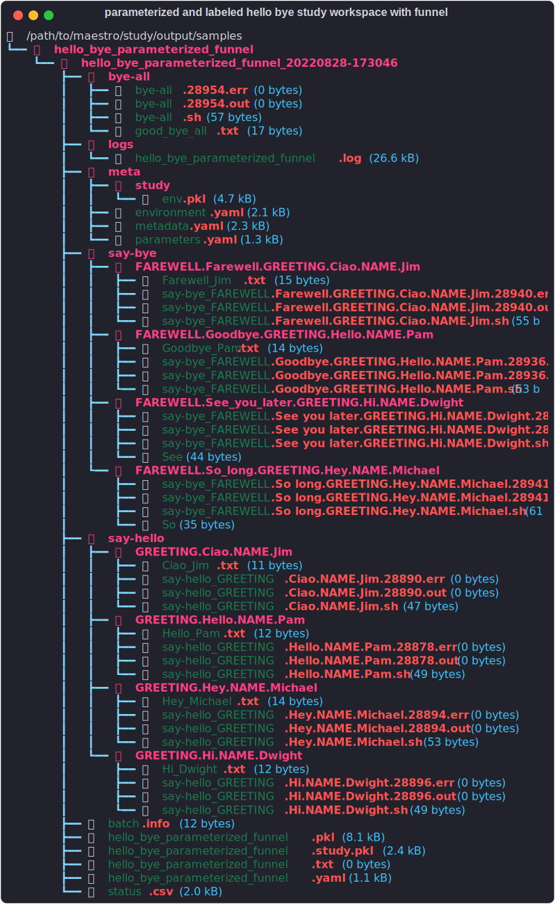

# Tutorials
----

This section will build up a complete example demonstrating the core features of Maestro studies and how to run and interact with them.  These examples can be found in the `samples` directory at the root of the git repository in addition to being copyable directly from the docs.

## Hello World
----

We'll start with a simple linear study, aka no parameters.  Create a `YAML` file named `hello_world.yaml` and start with the two keys that are required to make a runnable study specification: `description` and `study`.  Documentation and repeatability are core features of Maestro, and the description is one of the means of enforcing these.  Two keys are required for the `description` block, `name` and `description`, as shown below:

``` yaml
description:
    name: hello_world
    description: A simple 'Hello World' study.
```

Now that we have the documentation and purpose of the study embedded into it it's time to add something for it to actually do.  This is done via the `study` block, which contains a list of study steps.  We'll use the `-` `YAML` syntax here as each step is a `YAML` node containing a mapping (key value pairs/dictionary).  As with the study level `description`, each step is required to have a `name` and a `description`.  `name` is a unique identifier here and can be used in references as shown in subsequent examples.  

!!! warning

    Step names get used in the workspaces created on the file system, so be mindful of that when naming steps.

Finally there is the `run` block, which contains at a minimum a `cmd` key which contains the actual shell commands to run.  Currently these are bash only.  We use the `|` `YAML` syntax to denote the following will be multiple lines but all are stored in the `cmd` key:

``` yaml
description:
    name: hello_world
    description: A simple 'Hello World' study.
    
study:
    - name: say-hello
      description: Say hello to the world!
      run:
          cmd: |
            echo "Hello, World!" > hello_world.txt
```

!!! success

    We now have a complete, runnable Maestro Spec!

### Concepts

Here we take a very brief aside on a few key concepts to keep in mind when using Maestro.  A fundamental concept in Maestro is that the steps (say-hello above) are a discrete unit of work.  Similarly the study encapsulates all the units of work and their execution order dependencies in the given workflow.  As we will see in following variants, these units of work we are describing in the steps are actually templates, decoupling any parameter values you may want to inject from the description of the work being done, enabling a more clear view of the intent of the processes.

### The `run` command

In the previous sections we built a complete Maestro study, now it's time to run it.  The `run` subcommand is how you tell Maestro to go and execute this study we've defined:

``` console
maestro run study.yaml
```

There are many additional arguments you can pass to each subcommand, but for this study there is one that is particularly relevant: `sleep`.  By default Maestro will sleep for 60 seconds between checks for submitting new jobs and checking on status of existing jobs.  As most of the studies in the tutorial run very quickly we can adjust this down to ~1s to get faster turnaround.

``` console title="maestro run -h" hl_lines="1 4 14 15"
usage: maestro run [-h] [-a ATTEMPTS] [-r RLIMIT] [-t THROTTLE] [-s SLEEPTIME] [--dry] [-p PGEN] [--pargs PARGS] [-o OUT] [-fg] [--hashws] [-n | -y] [--usetmp] specification

positional arguments:
  specification         The path to a Study YAML specification that will be loaded and executed.

options:
  -h, --help            show this help message and exit
  -a ATTEMPTS, --attempts ATTEMPTS
                        Maximum number of submission attempts before a step is marked as failed. [Default: 1]
  -r RLIMIT, --rlimit RLIMIT
                        Maximum number of restarts allowed when steps. specify a restart command (0 denotes no limit). [Default: 1]
  -t THROTTLE, --throttle THROTTLE
                        Maximum number of inflight jobs allowed to execute simultaneously (0 denotes not throttling). [Default: 0]
  -s SLEEPTIME, --sleeptime SLEEPTIME
                        Amount of time (in seconds) for the manager to wait between job status checks. [Default: 60]
  --dry                 Generate the directory structure and scripts for a study but do not launch it. [Default: False]
  -p PGEN, --pgen PGEN  Path to a Python code file containing a function that returns a custom filled ParameterGenerator instance.
  --pargs PARGS         A string that represents a single argument to pass a custom parameter generation function. Reuse '--pargs' to pass multiple arguments. [Use with '--pgen']
  -o OUT, --out OUT     Output path to place study in. [NOTE: overrides OUTPUT_PATH in the specified specification]
  -fg                   Runs the backend conductor in the foreground instead of using nohup. [Default: False]
  --hashws              Enable hashing of subdirectories in parameterized studies (NOTE: breaks commands that use parameter labels to search directories). [Default: False]
  -n, --autono          Automatically answer no to input prompts.
  -y, --autoyes         Automatically answer yes to input prompts.
  --usetmp              Make use of a temporary directory for dumping scripts and other Maestro related files.
```


``` console title='Running the Hello World study'
$ maestro run hello_world.yaml -s 1
[2022-08-27 23:42:48: INFO] INFO Logging Level -- Enabled
[2022-08-27 23:42:48: WARNING] WARNING Logging Level -- Enabled
[2022-08-27 23:42:48: CRITICAL] CRITICAL Logging Level -- Enabled
[2022-08-27 23:42:48: INFO] Loading specification -- path = hello_world.yaml
[2022-08-27 23:42:48: INFO] Directory does not exist. Creating directories to /path/to/maestro/outputs/hello_world/hello_world_20220827-234248/logs
[2022-08-27 23:42:48: INFO] Adding step 'hello_world' to study 'hello_world'...
[2022-08-27 23:42:48: INFO]
------------------------------------------
Submission attempts =       1
Submission restart limit =  1
Submission throttle limit = 0
Use temporary directory =   False
Hash workspaces =           False
Dry run enabled =           False
Output path =               /path/to/maestro/outputs/hello_world/hello_world_20220827-234248
------------------------------------------
Would you like to launch the study? [yn] y
Study launched successfully.
```

Maestro will prompt you to actually launch the study before submitting, letting you confirm some of the settings first.  These options will be covered later in these tutorials, the [how-to sections](how_to_guides/index.md), and the [cli reference](cli.md).

### Checking the status

After invoking `maestro run hello_world.yaml -s 1` you won't see any output directly.  Looking back at the specification that was written, the "Hello World!" output we are looking for is actually written to a file `hello_world.txt`.  Do an `ls` on your current workspace and you will see Maestro created some new folders when it executed the study.  In this case it will simply be the name of the study, from the `description` block, with a date-timestamp appended to it using an `_`.  To see if anything actually ran, maestro provides a `status` sub command, which takes that `study_name_date-timestamp` directory as the only required argument.  Note that the status output automatically wraps text in columns so that the table fits within the current width of your terminal, which you can see happening in the sample output below.  There are some additional layout options you can explore via `maestro status -h` such as `narrow` which can help with this if you have trouble making your terminal wide enough.  The output also adapts to your terminal's color theme, and thus the sample below may look different for you.

``` console
maestro status /path/to/study/output/hello_world_20220712-230235
```


### Outputs

Now let's take a look at what actually got written to that date-timestamped output directory we found.  You will see something similar to the snapshot below:


!!! note

    The output above was generated with the help of the excellent [Rich Library](https://github.com/Textualize/rich), which is also used for rendering the study status.  See the INSERT LINK script if you wish to reproduce the view for your own study workspaces

Inside that date-timestamped workspace that contains this instance of the executed study is more than you might expect to get generated for a study who's only output is the "hello_world.txt" that is generated in the actual study step.  Most of this is metadata Maestro needs for generating and running the study (`meta` folder), log files which you can use to debug your studies (see `maestro -h` for debug/log options), the pickle file Maestro creates for managing study data while running, and then finally the workspaces for each of the steps in the study.  In this case we have a single directory with `name` from the specification, combined with error and standard outputs from the executed shell script, the generated output file `hello_world.txt` and the shell script itself `hello_world.sh`.  This last file is one of the more important pieces as it is the shell script as Maestro ran it.  This enables both debugging and verifying pre run (using `--dry` argument to the `run` command), as well as rerunning.  This shell script is runnable as is without Maestro, enabling more rapid debugging and testing of it.  

### Environment (`env`) block

If you keep launching new instances of this study you will quickly have a whole bunch of `hello_world_date-timestamp` directories cluttering up the local workspace along side where your `hello_world.yaml` study specification is.  Maestro provides a facility to help with this in the optional `env`, or environment block.  In this block, under the `variables` sub-block you can specify an optional `OUTPUT_PATH` variable, which is a special token maestro looks for to generate a parent directory to write all those timestamped study instances to and keep them more organized.  Adding that to our specification, all timestamped directories will now be written into a `samples` directory that is located at the same level as our `hello_world.yaml` study specification.  Note that relative pathing works and is relative to the study specification, but absolute paths can also be used.

``` yaml
description:
    name: hello_world
    description: A simple 'Hello World' study.
   
env:
    variables:
      OUTPUT_PATH: ./samples
      
study:
    - name: say-hello
      description: Say hello to the world!
      run:
          cmd: |
            echo "Hello, World!" > hello_world.txt
```

### Workflow topology

One final detail to note here is the topology of the workflow we have built.  Studies are organized using directed acyclic graphs, or DAG's, and Maestro's input features enable building DAG's with several topologies which we will highlight as we go.  This example uses the simplest, which is a single step, unparameterized (or linear) graph as shown below


Here `study root` has special meaning, and is always the root of the DAG's that define a study despite not being an actual step in your workflow.

## Hello, Bye World
----

Now that we've got a taste for what a Maestro specification looks like, how to run it, and what it generates, it's time to look into more interesting workflow topologies.  That was a lot of work for echoing "Hello World", but we now have a framework to build on and do a whole lot more with minimal extra work.  A common next step in defining studies and workflows is to add dependent or child steps using the optional `depends` key in study steps' `run` block.  Let's add a second step that says 'good-bye', but we also don't want this to run until after we say 'hello'.  The `depends` key simply takes a list of other step names, which tells Maestro to not run this step until those dependencies have successfully completed.

``` yaml
description:
    name: hello_bye_world
    description: A simple 'Hello World' study.
   
env:
    variables:
      OUTPUT_PATH: ./samples/hello_bye_world
      
study:
    - name: say-hello
      description: Say hello to the world!
      run:
          cmd: |
            echo "Hello, World!" > hello_world.txt
            
    - name: say-bye
      description: Say good bye to the world!
      run:
          cmd: |
            echo "Good-bye, World!" > good_bye_world.txt
          depends: [say-hello]
```

### Workflow Topology

Now our topology is slightly more interesting:


### Outputs

The outputs for this new study now have an extra step, as well as some more isolation via the `OUTPUT_PATH` set to contain all of this study's outputs in it's own sub-directory `hello_bye_world`.


!!! note

    The step listing in the workspace will reflect file system ordering, not the order defined in the workflow/study specification.

## Parameterized Hello World

This example introduces a new block: `global.parameters` (see [Specifying Study Parameters](parameter_specification.md) for more details).  With this we can further change the workflow topology by layering on parameters to the `Hello Bye World` example which Maestro will expand into multiple chains of 'Hello' -> 'Bye' steps.  Two parameters are added: `NAME` and `GREETING`, each with multiple values.  These are added in a dictionary style with keys being the parameter names and their values being dictionaries themselves with a `values` key that is a list of values to map the study steps/graph onto, and a label which is a `<string>.%%` format, where the `.%%` is replaced with parameter values.  These labels are used for constructing unique step names and workspaces as will be shown below.

``` yaml
global.parameters:
    NAME:
        values: [Pam, Jim, Michael, Dwight]
        label: NAME.%%
    GREETING:
        values: [Hello, Ciao, Hey, Hi]
        label: GREETING.%%
```

These parameter values are 1-1 pairings that define the set of parameter combinations, not cross products.  The above parameter set builds 4 parameter combos:

|            | Combo #1 | Combo #2 | Combo #3 | Combo #4 |
| :-         | :-:      | :-:      | :-:      | :-:      |
| `NAME`     | Pam      | Jim      | Michael  | Dwight   |
| `GREETING` | Hello    | Ciao     | Hey      | Hi       |

Maestro automatically scans steps and their keys for tokens matching these `global.parameters` entries using a special syntax with the token name wrapped in `$()` constructs.  Below is the hello bye world specification with these two parameters added into the say-hello step:

``` yaml
description:
    name: hello_bye_parameterized
    description: A study that says hello and bye to multiple people.

env:
    variables:
        OUTPUT_PATH: ./samples/hello_bye_parameterized

study:
    - name: say-hello
      description: Say hello to someone!
      run:
          cmd: |
            echo "$(GREETING), $(NAME)!" > hello.txt

    - name: say-bye
      description: Say bye to someone!
      run:
          cmd: |
            echo "Good-bye, World!" > good_bye_world.txt
          depends: [say-hello]

global.parameters:
    NAME:
        values: [Pam, Jim, Michael, Dwight]
        label: NAME.%%
    GREETING:
        values: [Hello, Ciao, Hey, Hi]
        label: GREETING.%%
```

### Workflow Topology


### Outputs

The outputs for parameterized studies look a little different.  In each parameterized step there is an additional hierarchy in the directory structure.  Each step still has it's own directory, but inside of those there is now one directory for each parameterized instance of the step.  You'll note the `label` values shown in the `YAML` specification for each parameter are used to construct unique paths to identify each parameter combination.


A few details stick out here.  You may notice that the `say-bye` step appears to be parameterized even though we did not put any `$(NAME), $(GREETING)` tokens in that step in the study specification.  When Maestro encounters a step that depends upon a parameterized step it will automatically propagate those parameters down, creating parameterized instances of any child steps.  The exception is the [depends on all](#parameterized-hello-bye-study-with-funnel-dependency) type of dependency, which will be discussed in the next example extension.

### Labels

One more detail that is potentially confusing when working with these outputs is that they all have the same name `'hello.txt'` even though each one contains a different string.  We can use another feature of the Environment (`env`) block to parameterize that as well.  Labels are intepreted as strings, and are processed before expansion of the `global.parameters`, enabling their use for dynamic formatting/naming of things in steps in a reusable way.  The study specification with these few additions is below:

``` yaml hl_lines="8 9 16"
description:
    name: hello_bye_parameterized
    description: A study that says hello and bye to multiple people.

env:
    variables:
        OUTPUT_PATH: ./samples/hello_bye_parameterized
    labels:
        OUT_FORMAT: $(GREETING)_$(NAME).txt

study:
    - name: say-hello
      description: Say hello to someone!
      run:
          cmd: |
            echo "$(GREETING), $(NAME)!" > $(OUT_FORMAT)

    - name: say-bye
      description: Say bye to someone!
      run:
          cmd: |
            echo "Good-bye, World!" > good_bye_world.txt
          depends: [say-hello]

global.parameters:
    NAME:
        values: [Pam, Jim, Michael, Dwight]
        label: NAME.%%
    GREETING:
        values: [Hello, Ciao, Hey, Hi]
        label: GREETING.%%
```

And with that slight change we have output files that don't require any file system context to identify.


## Parameterized Hello, Bye Study with Funnel Dependency

There is one more type of dependency that can be used to create a new topology in your workflow/study graphs.  Steps can be made dependent on the successful completion of all parameterized versions of the named parent step using the syntax `[<step-name>_*]`, with the `_*`.  The new study will add both an extra step and an extra parameter.  A new step will say bye to someone, each with a different greeting, before a final good bye step directed at everyone after the individual goodbyes are said.  Note the highlighted changes in this new study

``` yaml hl_lines="9 10 17 23 26-31 40-42"
description:
    name: hello_bye_parameterized_funnel
    description: A study that says hello and bye to multiple people, and a final good bye to all.

env:
    variables:
        OUTPUT_PATH: ./samples/hello_bye_parameterized_funnel
    labels:
        HELLO_FORMAT: $(GREETING)_$(NAME).txt
        BYE_FORMAT: $(FAREWELL)_$(NAME).txt

study:
    - name: say-hello
      description: Say hello to someone!
      run:
          cmd: |
            echo "$(GREETING), $(NAME)!" > $(HELLO_FORMAT)

    - name: say-bye
      description: Say bye to someone!
      run:
          cmd: |
            echo "$(FAREWELL), $(NAME)!" > $(BYE_FORMAT)
          depends: [say-hello]

    - name: bye-all
      description: Say bye to everyone!
      run:
          cmd: |
            echo "Good-bye, World!" > good_bye_all.txt
          depends: [say-bye_*]

global.parameters:
    NAME:
        values: [Pam, Jim, Michael, Dwight]
        label: NAME.%%
    GREETING:
        values: [Hello, Ciao, Hey, Hi]
        label: GREETING.%%
    FAREWELL:
        values: [Goodbye, Farewell, So long, See you later]
        label: FAREWELL.%%
```

!!! note

    An important effect of this dependency type is that any step with it requires all parent steps to complete successfully.  If you need the funnel/depends-all step to run no matter what you need to account for a successful return type in the parameterized steps.  See HOW_TO_GUIDES and OTHER_SECTIONS <!-- HOW_TO_GUIDE --> for more discussion of this behavior and how to deal with it.

### Workflow Topology

The new parameter expands the parameter combinations in the workflow:

|            | Combo #1 | Combo #2 | Combo #3 | Combo #4      |
| :-         | :-:      | :-:      | :-:      | :-:           |
| `NAME`     | Pam      | Jim      | Michael  | Dwight        |
| `GREETING` | Hello    | Ciao     | Hey      | Hi            |
| `FAREWELL` | Goodbye  | Farewell | So long  | See you later |


### Outputs

Note the extra parameter also shows up in the `'say-hello'` step despite not being explicitly used.  Maestro currently propagates parameter combinations, not just used parameters.

{: style="width:80ch"}

!!! warning

    This unique labeling of directories cannot be extended indefinitely.  Operating systems do have fixed path lengths that must be respected.  To accomodate this, Maestro offers a hashing option at run-time to enable arbitrarily large numbers of parameters in each combination: `maestro run study.yaml --hashws ...`

## Overriding Parameter Block with Python

<!-- Add link to pgen section of how-to-guides -->
Additional flexibility is sometimes needed when specifying study parameters, and Maestro provides a python
interface for this via the Parameter Generator, or `pgen`.  This is a user supplied function of a specific
signature that populates a `ParameterGenerator` object.  Invoking these custom generators is a simple extra argument to the `run` command:

``` console
maestro run study.yaml --pgen my_custom_generator.py
```

This will override any parameters that are defined in the study.yaml, enabling the specification to remain
runnable on it's own.  Below shows what the `my_custom_generator.py` file looks like using this functionality to recreate the same parameter combinations used in the previous examples:

``` python
from maestrowf.datastructures.core import ParameterGenerator

def get_custom_generator(env, **kwargs):
    p_gen = ParameterGenerator()
    
    params = {
        "NAME": {
            "values": ['Pam', 'Jim', 'Michael', 'Dwight'],
            "label": "NAME.%%"
        },
        "GREETING": {
            "values": ['Hello', 'Ciao', 'Hey', 'Hi'],
            "label": "GREETING.%%"
        },
        "FAREWELL": {
            "values": ['Goodbye', 'Farewell', 'So long', 'See you later'],
            "label": "FAREWELL.%%"
        },
    }

    for key, value in params.items():
        p_gen.add_parameter(key, value["values"], value["label"])

    return p_gen
```

!!! note

    This can use any python package that is installed in the virtual environment that you are running maestro in.  See [How-to Guides](#how-to-guides) for further examples

## Running a study on HPC Clusters

There is one last block in the study specification that hasn't been used yet, and that is the `batch` block.
Adding this block enables Maestro to schedule steps to run on remote nodes on HPC clusters by interfacing
with schedulers such as SLURM and Flux.  A few new keys also become available in the steps' `run` blocks which
enable specification of the steps resource requirements such as the number of nodes and processors to reserve
and the wall time (duration) to request them for.

``` yaml linenums="1" hl_lines="5-9 24-26 34-36 44-46"
description:
    name: hello_bye_parameterized_funnel
    description: A study that says hello and bye to multiple people, and a final good bye to all.

batch:
    type        : slurm
    host        : quartz
    bank        : baasic
    queue       : pdebug

env:
    variables:
        OUTPUT_PATH: ./samples/hello_bye_parameterized_funnel
    labels:
        HELLO_FORMAT: $(GREETING)_$(NAME).txt
        BYE_FORMAT: $(FAREWELL)_$(NAME).txt

study:
    - name: say-hello
      description: Say hello to someone!
      run:
          cmd: |
            echo "$(GREETING), $(NAME)!" > $(HELLO_FORMAT)
          nodes: 1
          procs: 1
          walltime: "00:00:30"

    - name: say-bye
      description: Say bye to someone!
      run:
          cmd: |
            echo "$(FAREWELL), $(NAME)!" > $(BYE_FORMAT)
          depends: [say-hello]
          nodes: 1
          procs: 1
          walltime: "00:00:30"

    - name: bye-all
      description: Say bye to everyone!
      run:
          cmd: |
            echo "Good-bye, World!" > good_bye_all.txt
          depends: [say-bye_*]
          nodes: 1
          procs: 1
          walltime: "00:00:30"

global.parameters:
    NAME:
        values: [Pam, Jim, Michael, Dwight]
        label: NAME.%%
    GREETING:
        values: [Hello, Ciao, Hey, Hi]
        label: GREETING.%%
    FAREWELL:
        values: [Goodbye, Farewell, So long, See you later]
        label: FAREWELL.%%
```

With the small additions above, each step will be submitted as batch jobs to the HPC cluster, enabling them to run in parallel.  Additionally, this interface has facilities for abstracting the invocations for mpi-parallel
processes within the steps.  Adding one of Maestro's special tokens, `$(LAUNCHER)`, to the steps as shown below will run the `echo` lines using the scheduler/cluster mpi wrapper.

``` yaml
    - name: say-hello
      description: Say hello to someone!
      run:
          cmd: |
            $(LAUNCHER) echo "$(GREETING), $(NAME)!" > $(HELLO_FORMAT)
          nodes: 1
          procs: 1
          walltime: "00:00:30"
```

When Maestro generates the batch script for this step it will utilize the information in the `batch` block and the resource specification keys such as `procs` and `nodes` to generate the system appropriate execution line for one of the parameter combinations.  In this example, we get the SLURM wrapper to run the `echo` command using a single mpi task on a single node.

``` shell
srun -n1 -N1 echo "Hello, Pam!" > Hello_Pam.txt
```

<!-- Add demo of status output and noting job id's in that output when running on clusters? -->

## Porting HPC Batch Scripts to Maestro

If you've been using HPC resources for some time already, you likely have a bunch of scheduler specific batch script based workflows already.  Converting those into Maestro workflow specifications and adding parameterization to them is pretty straight forward.  Lets look at how to do this using the Lulesh example in Maestros' [built in examples](https://github.com/LLNL/maestrowf/tree/develop/samples):

``` bash title="lulesh slurm batch script"
!/bin/bash

#SBATCH -N 1
#SBATCH -p pbatch
#SBATCH -t 00:10:00
#SBATCH -A baasic

srun -n 16 path/to/lulesh/repo/build/lulesh2.0 -s 100 -i 100 -p > lulesh_size100_iter100.log
```

### Basic Conversion of Batch Script to Maestro Specification

A first pass of porting this batch script to a Maestro spec would look like:

``` yaml title="initial port of lulesh slurm batch script to Maestro spec"
description:
    name: lulesh_study
    description: A study that runs lulesh once on SLURM.
    
batch:
    type        : slurm
    host        : quartz
    bank        : baasic
    queue       : pbatch
    
env:
    variables:
        OUTPUT_PATH: ./LULESH_STUDY
        
study:
    - name: run-lulesh
      description: Run LULESH.
      run:
          cmd: |
            $(LAUNCHER) path/to/lulesh/repo/build/lulesh2.0 \
            -s 100 -i 100 -p > lulesh_size100_iter100.log
          nodes: 1
          procs: 16
          exclusive   : True
          walltime: "00:10:00"
```

The only major difference so far is in using the `$(LAUNCHER)` token instead of the explicit `srun` in the script definition in the Maestro spec.  The batch/scheduler system information is converted to keys in the step (`nodes`, `procs`, `walltime`) and the batch block.  This leaves the step implementation decoupled from scheduler specifics, making it more portable (change the `batch: type:` key to another system) and more focused on the intent of the process (running lulesh) than the details of how it's running (srun ...).  Visually, the workflow topology for such a study is a simple two node graph as shown below, which Maestro constructs upon invoking `maestro run`:


!!! note

    We are using the `\` line continuation operator here for improved readability in the docs.  It is not necessary to use this in your steps for long lines, though it can help readability even in your ide/text editor

### Adding all the bells and whistles

Now that our workflow is defined in a Maestro study specification we can start layering on the extra bells and whistles that highlight the advantages of using Maestro even for simple one step workflows. A few of the options we're going to look at are:

* using parameters to run many variants of lulesh
* building step specific labels with parameters
* adding multiple steps and dependencies between steps to control execution order and workflow topology
* abstracting away step paths in the steps using Maestro's workflow language (`$(step-name.workspace)`)

#### Parameterization

We can trivially run a parameter study of lulesh with multiple input parameters and multiple parameter values.  Below we add 4 parameter combinations across two parameters to our study by making a few simple changes using [Maestro's token based DSL](specification.md#tokens-maestros-minimal-workflow-dsl): this DSL is all contained in the`$(TOKEN_NAME)` syntax in the updated example spec:

``` yaml title="adding parameters to the lulesh spec"
description:
    name: lulesh_study
    description: A study that runs a parameter study using LULESH on SLURM.
    
batch:
    type        : slurm
    host        : quartz
    bank        : baasic
    queue       : pbatch

env:
    variables:
        OUTPUT_PATH: ./LULESH_STUDY

    labels:
        lulesh_log: $(SIZE.label).$(ITERATIONS.label).log
        
study:
    - name: run-lulesh
      description: Run LULESH.
      run:
          cmd: |
            $(LAUNCHER) path/to/lulesh/repo/build/lulesh2.0 \
            -s $(SIZE) -i $(ITERATIONS) -p > $(lulesh_log)
          nodes: 1
          procs: 16
          exclusive   : True
          walltime: "00:10:00"
          
global.parameters:
    SIZE:
        values  : [100, 100, 200, 200]
        label   : SIZE.%%
    ITERATIONS:
        values  : [100, 200, 100, 200]
        label   : ITER.%%
```

!!! tip

    A key concept here is that the step definitions function more as a template of the work you want Maestro to do rather than a concrete instance of the work.  The parameter usage shown here presents a view more focused on the intent of your process, leaving the expansion into each concrete experiment (specific values/parameter combinations shown below) up to Maestro when `maestro run lulesh_spec.yaml` is invoked.
    
The parameter sets that run-lulesh is run against are:

|              | Combo #1 | Combo #2 | Combo #3 | Combo #4 |
| :-           | :-:      | :-:      | :-:      | :-:      |
| `SIZE`       | 100      | 100      | 200      | 200      |
| `ITERATIONS` | 100      | 200      | 100      | 200      |

And the resulting workflow topology when you run this study specification using `maestro run` (see [`run`](cli.md#run) for usage details and options) now looks like:


Note that the initial Maestro spec set an explicit name for the lulesh log file which tagged the size and iteration count in a hardwired manner.  In this parameterized form we can also let Maestro dyanmically name this log output using [`labels`](specification.md#labels-labels) in the [`env` block](specification.md#environment-env).  The `lulesh_log` label injects the parameter labels into the log file name at study staging time so each log file is uniquely named according to its parameter set: SIZE.100.ITER.100.log, SIZE.100.ITER.200.log, etc.

#### Expanding the topology of the workflow

Now that we've ported our bash/batch script workflow to Maestro, le's explore how easy it is to build on our workflow with Maestro by adding additional steps that depend upon each other.  We will add some dependent steps to do some processing for each simulation (one per parameter combination) and a reporting step for collecting the metrics from each parameter set for a summary report.

``` yaml title="add dependent steps to the parameterized lulesh spec"
description:
    name: lulesh_study
    description: A study that runs a parameter study using LULESH on SLURM.
    
batch:
    type        : slurm
    host        : quartz
    bank        : baasic
    queue       : pbatch

env:
    variables:
        OUTPUT_PATH: ./LULESH_STUDY
        LULESH_SIM_POST: $(SPECROOT)/lulesh_sim_post.py
        LULESH_STUDY_REPORT: $(SPECROOT)/lulesh_study_summary.py

    labels:
        lulesh_log: $(SIZE.label).$(ITERATIONS.label).log
        lulesh_sim_metrics: $(SIZE.label).$(ITERATIONS.label).metrics
        
study:
    - name: run-lulesh
      description: Run LULESH.
      run:
          cmd: |
            $(LAUNCHER) path/to/lulesh/repo/build/lulesh2.0 \
            -s $(SIZE) -i $(ITERATIONS) -p > $(lulesh_log)
          nodes: 1
          procs: 16
          exclusive   : True
          walltime: "00:10:00"
          
    - name: lulesh-post
      description: Post processing of the LULESH outputs for a single simulation
      run:
          cmd: |
            $(LAUNCHER) python3 $(LULESH_SIM_POST) \
            --lulesh-log $(run-lulesh.workspace)/$(lulesh_log) \
            --out $(lulesh_sim_metrics)
          nodes: 1
          procs: 1
          walltime: "00:10:00"
          depends: [run-lulesh]
          
    - name: study-report
      description: Summary statics from all LULESH simulations in this study
      run:
          cmd: |
            $(LAUNCHER) python3 $(LULESH_STUDY_REPORT) \
            --metrics $(lulesh-post)/*/*.metrics \
            --report lulesh_summary.report
          nodes: 1
          procs: 1
          walltime: "00:10:00"
          depends: [lulesh-post_*]
          
global.parameters:
    SIZE:
        values  : [100, 100, 200, 200]
        label   : SIZE.%%
    ITERATIONS:
        values  : [100, 200, 100, 200]
        label   : ITER.%%
```

We now have per parameter set post processing steps that extract data from each individual simulation, using the `$(run-lulesh.workspace)` token to reach back into the individual simulation step workspaces to get the generated logs to process.  The `lulesh_sim_post.py` processing script expects a path to a lulesh log file, and this `$(run-lulesh.workspace)` token gets expanded to that path and injected into the concrete bash script by Maestro, easing the burden of managing where everything is located. 

This new `lulesh-post` step introduces the `depends: [run-lulesh]` key to indicate that this step will not run until the `run-lulesh` step with the same parameter set has finish.  The `study-report` uses a similar mechanism, but with a tweak to the `depends` key such that it requires all parameter combinations of the `lulesh-post` steps to finish before running using the syntax `depends: [lulesh-post_*]`.  Those simple additions to the spec tell Maestro to construct the workflow topology shown below when invoking `maestro run`:


Maestro handles the execution of these steps in the order we've defined in this graph, i.e. each lulesh-post step waits for it's corresponding run-lulesh step to finish before running, and the study-report step waits for all instances of lulesh-post to finish before running.

### Next steps

As potential next steps in enhancing your workflows with Maestro check out:

* The [full lulesh sample specifications](Maestro/specification.md#full-example)
* The [environment block](Maestro/specification.md#environment-env) to explore using dependencies instead of variables to manage both lulesh's executable and the supporting post-processing scripts
* [`pgen`](parameter_specification.md#parameter-generator-pgen) if you need more complicated parameter generation techniques/facilities
* If managing restarts for long running jobs that timeout is a concern in your workflow, look at the optional [`restart`](specification.md#run) key available in steps and the [`rlimit`](cli.md#run) option to the run command
* Collection of example specifications in the repository's [samples directory](https://github.com/LLNL/maestrowf/tree/develop/samples) and [How-to guides](how_to_guides/index.md) for additional examples/workflow solutions.
* And of course, a thorough tour of the tutorials on this page explain a lot more of the details of what's going on.
