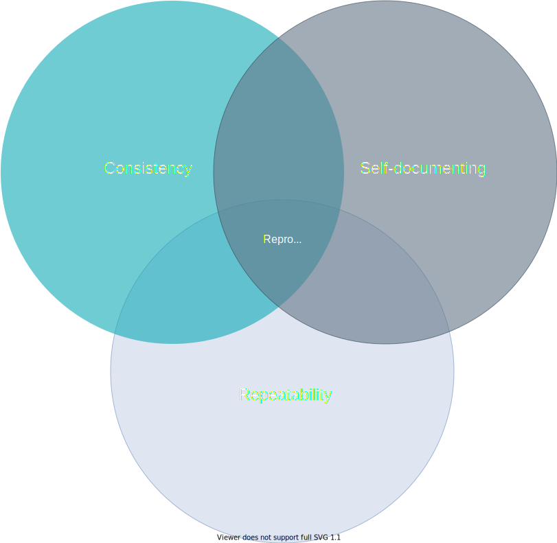

## Maestro's Foundation and Core Concepts
----

Maestro pulls its core concepts for executing computational workflows in an analogous fashion to what an experimentalist performs at a laboratory bench. [High performance computational resources](https://en.wikipedia.org/wiki/Supercomputer) are primarily focused on *studying* natural phenomena via [simulation (mathematical modeling)](https://en.wikipedia.org/wiki/Computer_simulation), and therefore follow a similar thought pattern. At the highest level, an experimentalist is responsible for the following:

1. Establishing, documenting, and communicating processes for running experiments
2. Running experiments over multiple parameters consistently
3. Repeating experiments on new and existing parameters

 
### Maestro Studies

We have designed Maestro around the core concept of what we call a "study". A study is defined as a set of steps that are executed (a workflow) over a set of parameters. A study in Maestro's context is analogous to an actual tangible scientific experiment, which has a set of clearly defined and repeatable steps which are repeated over multiple specimen.

Maestro is designed around the principles of self-documentation, consistency, and repeatability.

{: height="45%" width="45%" align=left}
#### Repeatability

Studies should be easily repeatable. Like any well-planned and implemented science experiment, a process should be run exact;y the same way each time for each parameter or over different runs of the study itself.

#### Consistent

Studies should be run in a consistent fashion. The removal of variation in the process means less mistakes when executing studies, ease of sharing with others, and uniformity in defining new studies.

#### Self-documenting

Documentation is critical in studies. The Maestro YAML Specification is an artifact documenting a complete workflow.
