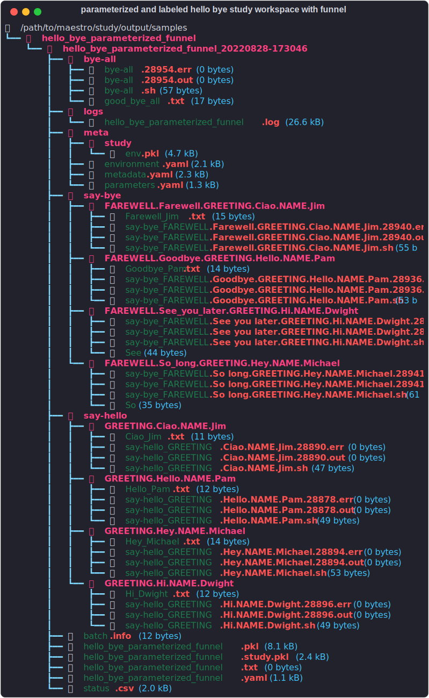

---
hide:
  - navigation
---


----

[On GitHub :fontawesome-brands-github:](https://github.com/LLNL/maestrowf){: .md-button .md-button--primary }

----


Bring rigor, reproducibility, and shareability to your computational science following the model set by the experimental disciplines.  Specify computational processes in a generalized way such that they can be documented, shared, executed, and easily reproduced.

## Why Maestro?

Maestro gives an easy path to automating and orchestrating your workflows, building upon your existing shell and batch (HPC scheduled scripts/tasks) script tasks to layer on parameterization, task dependencies, and output isolation.  Additionally, Maestro's workflow specification layer enables documenting those scripts and their interdependencies if chaining them together, and makes them more repeatable and shareable for enhanced collaboration with your peers.

## Getting Started is Quick and Easy

-   Install: build a virtual environment and install maestro into it (python 3.6 or greater)
    
    ``` console
    python -m virtualenv maestroenv
    
    source maestroenv/bin/activate
    
    pip install maestrowf
    ```
    
    And you now have the `maestro` command available in your shell

-   Create a `YAML` file named `study.yaml` and paste the following content into the file
    <!-- NOTE: add the ! after the annotations in later version of material theme to strip comments -->

    ``` yaml
    description: # (1)
        name: hello_bye_parameterized_funnel
        description: A study that says hello and bye to multiple people, and a final good bye to all.
    
    env:
        variables: # (2)
            OUTPUT_PATH: ./samples/hello_bye_parameterized_funnel
        labels: # (3)
            HELLO_FORMAT: $(GREETING)_$(NAME).txt
            BYE_FORMAT: $(FAREWELL)_$(NAME).txt
    
    study:
        - name: say-hello
          description: Say hello to someone!
          run: # (4)
              cmd: |
                echo "$(GREETING), $(NAME)!" > $(HELLO_FORMAT)
    
        - name: say-bye
          description: Say bye to someone!
          run:
              cmd: |
                echo "$(FAREWELL), $(NAME)!" > $(BYE_FORMAT)
              depends: [say-hello] # (5)
    
        - name: bye-all
          description: Say bye to everyone!
          run:
              cmd: |
                echo "Good-bye, World!" > good_bye_all.txt
              depends: [say-bye_*]
    
    global.parameters:
        NAME:  # (6)
            values: [Pam, Jim, Michael, Dwight]
            label: NAME.%%
        GREETING:
            values: [Hello, Ciao, Hey, Hi]
            label: GREETING.%%
        FAREWELL:
            values: [Goodbye, Farewell, So long, See you later]
            label: FAREWELL.%%
    ```
    
    1. Mandatory name and description fields to encourage documenting your workflows in a meaningful way
    2. Define single valued variable tokens for use in your workflow steps
    3. Define nested tokens for combining variables and parameters for more flexible token/substitution in your workflow steps
    4. `cmd` is a multline string, written in bash to harness the robust existing ecosystem of tools users are already familiar with
    5. Specify step dependencies using steps `name` to control execution order
    6. Define parameter tokens `$(NAME)` and lists of values to use in your steps such that Maestro can parameterize them for you
    
    > *PHILOSOPHY*: Maestro believes in the principle of a clearly defined process, specified as a list of tasks, that are self-documenting and clear in their intent.

-   Running the `hello_world` study is as simple as...

    ``` console
    maestro run study.yaml
    ```

-   Maestro `run` turns your workflow process specification and parameters into a task graph and executes them for you

    === "Hello World Workflow Graph"
        
        ``` mermaid
        flowchart TD
            A(study root) --> COMBO1
            subgraph COMBO1 [Combo #1]
              subgraph say_hello1 [say-hello]
                B(Hello, Pam)
              end
              subgraph say_bye1 [say-bye]
                C(Goodbye, Pam)
              end
              say_hello1 --> say_bye1
            end
            A --> COMBO2
            subgraph COMBO2 [Combo #2]
              subgraph say_hello2 [say-hello]
                D(Ciao, Jim)
              end
              subgraph say_bye2 [say-bye]
                E(Farewell, Jim)
              end
              say_hello2 --> say_bye2
            end
            A --> COMBO3
            subgraph COMBO3 [Combo #3]
              subgraph say_hello3 [say-hello]
                F(Hey, Michael)
              end
              subgraph say_bye3 [say-bye]
                G(So long, Michael)
              end
              say_hello3 --> say_bye3
            end
            A --> COMBO4
            subgraph COMBO4 [Combo #4]
              subgraph say_hello4 [say-hello]
                H(Hi, Dwight)
              end
              subgraph say_bye4 [say-bye]
                I(See you later, Dwight)
              end
              say_hello4 --> say_bye4
            end
            J{{bye-all}}
            COMBO1 --> J
            COMBO2 --> J
            COMBO3 --> J
            COMBO4 --> J
        ```

    === "Hello World Executed Workspace"
    
        Maestro manages the workspaces for each parameter set for you, ensuring isolation, and capturing the generated execution scripts with parameter/variable values inserted in place of the `$(PARAMNAME)` tokens
                
        {: style="width:80ch"}


## Maestro's Goals and Motivations
----

The primary goal of Maestro is to provide a lightweight tool for encouraging modularized workflow composition, a mental framework for thinking about these concepts, and a tool that users can flexibly utilize for a wide variety of use cases (science, software testing/deployment, and etc.). Maestro's vision aims to make steady progression towards making reproducible workflows user-friendly and easy to manage. We maintain a few high level principles:

1. Reproducibility is not free, nor is there a silver bullet to achieve it. It is a mixture of tooling, infrastructure, and best practices.
2. Workflow best practices should always be encouraged wherever possible, and enforced where reasonable.
3. It is not a workflow framework's place to force a user to use specific technologies -- a framework should couple minimally, but offer a high degree of flexibility.
4. Division of responsibility is critical. Data management, optimal performance, and orchestration are related but separate.
5. A workflow should be coherent and easy to communicate, with a framework providing users a mental framework to think and discuss such challenges.

We firmly believe that a user-friendly tool and environment that promotes provenance and best practices, while minimizing the effort needed for users to achieve progress, will greatly improve the quality of computational science.


## Next Steps

Explore the complete set of features Maestro can bring to your computational workflows and how to use them in the [User Guide](Maestro/index.md):

- Start from scratch with [tutorials](Maestro/tutorials.md)
- [Port an existing HPC (SLURM, LSF, etc) batch script](Maestro/tutorials.md#porting-hpc-batch-scripts-to-maestro)
- [How-to guides](Maestro/how_to_guides/index.md)
- Full yaml input [specification](Maestro/specification.md)
- Colleciton of example specifications in the repo's [samples directory](https://github.com/LLNL/maestrowf/tree/develop/samples)
- and more

Or, read up on more of the philosophies behind Maestro's design: [Philosopy](Philosophy/index.md).

Additionally, check out some of the contributed tools and recipes in the [Maestro Sheetmusic](https://github.com/LLNL/maestro_sheetmusic) repo.  Contributions welcome if you create any generally useful tools in your workflow adventures with Maestro and want to share!

## Contributors

Many thanks go to MaestroWF's [contributors](https://github.com/LLNL/maestrowf/graphs/contributors).

If you have any questions or to submit feature requests please [open a ticket](https://github.com/llnl/maestrowf/issues).

----------------

## Release
MaestroWF is released under an MIT license.  For more details see the
NOTICE and LICENSE files.

``LLNL-CODE-734340``
