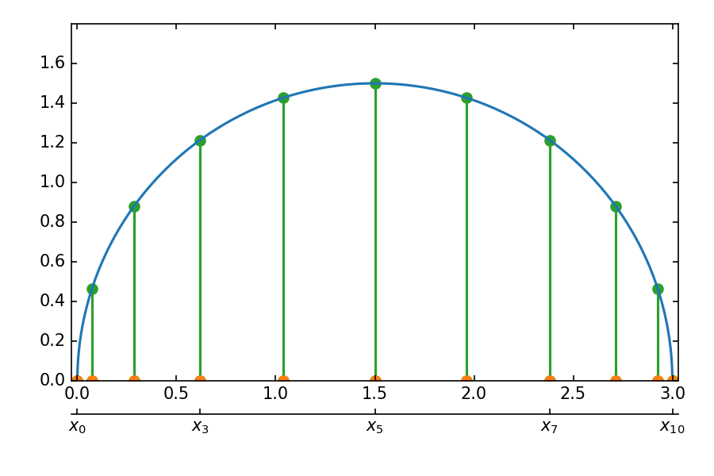

=============================
 Specifying Study Parameters
=============================

Maestro supports parameterization as a means of iterating over steps in a study with varying information.  Maestro uses token replacement to define variables in the study specification to be replaced when executing the study.  Token replacement can be used in various contexts in Maestro; however Maestro implements specific features for managing parameters.

.. note
   add (as described in Maestro Token Replacement) reference before the ; when section is added

Maestro makes no assumptions about how parameters are defined or used in a study, enabling flexibility in regards to how a study may be configured with parameters.

There are two ways Maestro supports parameters:

  * Directly in the study specification as the ``global.parameters`` block

  * Through the use of a user created Python module called :ref:`pgen_section`

.. note
   add reference to this section from the hello_world examples (ref here for more thorough discussion of parameters)
   similar for the token replacement sections: hello_world should be the quick start, not the exhaustive  discussion

Maestro Parameter Block
=======================

The quickest and easiest way to setup parameters in a Maestro study is by defining a ``global.parameters`` block directly in the specification

.. code-block:: yaml
   :linenos:

   global.parameters:
    TRIAL:
        values  : [1, 2, 3, 4, 5, 6, 7, 8, 9]
        label   : TRIAL.%%
    SIZE:
        values  : [10, 10, 10, 20, 20, 20, 30, 30, 30]
        label   : SIZE.%%
    ITERATIONS:
        values  : [10, 20, 30, 10, 20, 30, 10, 20, 30]
        label   : ITER.%%

The above example defines the parameters ``TRIAL``, ``SIZE``, and ``ITERATIONS``. Parameters can be used in study steps to vary information. When a parameter is defined in a study, Maestro will automatically detect the usage of a parameter moniker and handle the substitution automatically in the study expansion. This ensures that each set of parameters are run as part of the study.

The ``label`` key in the block specifies the pattern to use for the directory name when the workspace is created. By default, Maestro constructs a unique workspace for each parameter combination.

Defining multiple parameters in the parameter block will share a 1:1 mapping. Maestro requires all combinations be resolved when using the parameter block. The combinations in the above example will be expanded as follows:

  * TRIAL.1.SIZE.10.ITERATIONS.10

  * TRIAL.2.SIZE.10.ITERATIONS.20

  * TRIAL.3.SIZE.10.ITERATIONS.30

  * ...

Maestro does not do any additional operations on parameters such as cross products. If more complex methodologies are required to define parameters then the use of Maestro's :ref:`pgen_section` is recommended.

.. note
   If you plan to use :ref:`PGEN <pgen section_>`_ exclusively, then we suggest you comment out the ``global.parameters`` section completely. The length of the ``value`` array for each parameter must be the same otherwise, *even if you do not use those parameter values in your PGEN study*.

Defined parameters can be used in steps directly:

.. code-block:: yaml
   :linenos:

   - name: run-lulesh
     description: Run LULESH.
     run:
       cmd: |
           $(LULESH)/lulesh2.0 -s $(SIZE) -i $(ITERATIONS) -p > $(outfile)
       depends: [make-lulesh]

Even though this is defined in Maestro as a single step, Maestro will automatically run this step with each parameter combinations. This makes it very easy to setup studies and apply parameters to be run.

.. note::

   Maestro will only use parameters if they've been defined in at least one step

In addition to direct access to parameter values, a parameter label can be used in steps by appending the ``.label`` moniker to the name (as seen below with ``$(ITERATIONS.label)``):

.. code-block:: yaml
   :linenos:

   - name: run-lulesh
     description: Run LULESH.
     run:
       cmd: |
           echo "Running case: $(SIZE.label), $(ITERATIONS.label)"
           $(LULESH)/lulesh2.0 -s $(SIZE) -i $(ITERATIONS) -p > $(outfile)
       depends: [make-lulesh]


What can be Parameterized in Maestro?
=====================================

A common use case for Maestro is to use the parameter block to specify values to iterate over for a simulation parameter study; however, Maestro does not make any assumptions about what these values are. This makes the use of Maestro's parameter block very flexible. For example, Maestro does not require the parameter variations to be numeric.

.. code-block:: yaml
   :linenos:
   :caption: study.yaml

   study:
    - name: run-simulation
      description: Run a simulation.
      run:
        cmd: |
            $(CODE) -in $(SPECROOT)/$(INPUT)
      depends: []

   global.parameters:
       INPUT:
           values  : [input1.in, input2.in, input3.in]
           label   : INPUT.%%

The above example highlights a partial study spec that defines a parameter block of simulation inputs that will be varied when the study runs. The ``run-simulation`` step  will run three times, once for each defined input file.

.. code-block:: yaml
   :linenos:
   :caption: study.yaml

   study:
       - name: run-simulation
         description: Run a simulation.
         run:
           cmd: |
               $(CODE_PATH)/$(VERSION)/code.exe -in $(SPECROOT)/$(INPUT)
         depends: []

   global.parameters:
       INPUT:
           values  : [input1.in, input2.in, input3.in, input1.in, input2.in, input3.in]
           label   : INPUT.%%
       VERSION:
           values  : [4.0.0, 4.0.0, 4.0.0, 5.0.0, 5.0.0, 5.0.0]
           label   : VERSION.%%

This example parameterizes the inputs and the version of the code being run.  Maestro will run each input with the different code version.  The above example assumes that all the code versions share a base path, ``$(CODE_PATH)`` which is inserted via the token replacment mechanism to yeild the full paths (e.g. /usr/gapps/code/4.0.0/code.exe).

Where can Parameters be used in Study Steps?
============================================

Maestro uses monikers to reference parameters in study steps, and will automatically perform token replacement on used parameters when the study is run. The page Maestro Token Replacement goes into detail about how token replacement works in Maestro.

.. note
   add maestro token replacement section reference

Maestro is very flexible in the way it manages token replacement for parameters and as such tokens can be used in a variety of ways in a study.

Cmd block
---------

Parameters can be defined in the Maestro ``cmd`` block in the study step. Everything in Maestro's ``cmd`` block will be written to a bash shell or batch script (if batch is configured). Any shell commands should be valid in the ``cmd`` block. A common way to use parameters is to pass them in via arguments to a code, script, or tool.

.. code-block:: yaml
   :linenos:
   :caption: study.yaml

   ...

   - name: run-simulation
     description: Run a simulation.
       run:
           cmd: |
               /usr/gapps/code/bin/code -in input.in -def param $(PARAM)
           depends: []

   ...

The specific syntax for using a parameter with a specific code, script, or tool will depend on how the application supports command line arguments.

Batch Configuration Keys
------------------------

Step based batch configurations can also be parameterized in Maestro. This provides an easy way to configure scaling studies or to manage studies where batch settings are dependent on the parameter values.

.. code-block:: yaml
   :linenos:
   :caption: study.yaml

   study:
       - name: run-simulation
         description: Run a simulation.
         run:
           cmd: |
               $(CODE_PATH)/$(VERSION)/code.exe -in input.in -def RES $(RES)
           procs: $(PROC)
           nodes: $(NODE)
           walltime: $(WALLTIME)
           depends: []

   global.parameters:
       RES:
           values  : [2, 4, 6, 8]
           label   : RES.%%
       PROC:
           values  : [8, 8, 16, 32]
           label   : PROC.%%
       NODE:
           values  : [1, 1, 2, 4]
           label   : NODE.%%
       WALLTIME:
           values  : ["00:10:00", "00:15:00", "00:30:00", "01:00:00"]
           label   : PROC.%%

.. note
   Add some dag graphs in here at some point?

.. _pgen_section:

Parameter Generator (pgen)
==========================

Maestro's Parameter Generator (**pgen**) supports setting up more flexible and complex parameter generation.  Maestro's pgen is a user supplied python file that contains the parameter generation logic, overriding the ``global.parameters`` block in the yaml specification file.  To run a Maestro study using a parameter generator just pass in the path to the **pgen** file to Maestro on the command line when launching the study, such as this example where the study specification file and **pgen** file live in the same directory:

.. code-block:: bash

   $ maestro run study.yaml --pgen pgen.py

The minimum requirements for making a valid pgen file is to make a function called :py:func:`get_custom_generator` which returns a Maestro :py:class:`~maestrowf.datastructures.core.ParameterGenerator` object as demonstrated in the simple example below:

.. code-block:: python
   :linenos:

   from maestrowf.datastructures.core import ParameterGenerator

   def get_custom_generator(env, **kwargs):
       p_gen = ParameterGenerator()
       params = {
           "COUNT": {
               "values": [i for i in range(1, 10)],
               "label": "COUNT.%%"
           },
       }

       for key, value in params.items():
           p_gen.add_parameter(key, value["values"], value["label"])

       return p_gen


The object simply builds the same nested key:value pairs seen in the ``global.parameters`` block available in the yaml specification.

For this simple example above, this may not offer compelling advantages over writing out the flattened list in the yaml specification directly.  This programmatic approach becomes preferable when expanding studies to use hundreds of parameters and parameter values or requiring non-trivial parameter value distributions.  The following examples will demonstrate these scenarios using both standard python library tools and additional 3rd party packages from the larger python ecosystem.

EXAMPLE:
  Using Python's standard `itertools <https://docs.python.org/3/library/itertools.html?highlight=itertools>`_ package to perform a Cartesian Product of parameters in the lulesh example specification.

.. literalinclude:: ../../samples/parameterization/lulesh_itertools_pgen.py
   :language: python
   :caption: lulesh_itertools_pgen.py
   :name: lulesh_itertools_pgen
   :linenos:

This results in the following set of parameters, matching the lulesh sample workflow:

.. table:: Sample parameters from itertools_pgen.py

   =========== ==== ==== ==== ==== ==== ==== ==== ==== ====
    Parameter   Values
   ----------- --------------------------------------------
    TRIAL        0    1    2    3    4    5    6    7    8
   ----------- ---- ---- ---- ---- ---- ---- ---- ---- ----
    SIZE        10   10   10   20   20   20   30   30   30
   ----------- ---- ---- ---- ---- ---- ---- ---- ---- ----
    ITER        10   20   30   10   20   30   10   20   30
   =========== ==== ==== ==== ==== ==== ==== ==== ==== ====

.. _pargs_section:

Pgen Arguments (pargs)
----------------------

There is an additional :ref:`pgen <pgen_section>` feature that can be used to make them more dynamic.  The above example generates a fixed set of parameters, requiring editing the :ref:`lulesh_itertools_pgen` file to change that.  Maestro supports passing arguments to these generator functions on the command line:


.. code-block:: bash

   $ maestro run study.yaml --pgen itertools_pgen_pargs.py --parg "SIZE_MIN:10" --parg "SIZE_STEP:10" --parg "NUM_SIZES:4"

Each argument is a string in ``key:value`` form, which can be accessed in the parameter generator function as shown below:

.. code-block:: python
   :name: itertools_pgen_pargs.py
   :caption: itertools_pgen_pargs.py
   :linenos:

   from maestrowf.datastructures.core import ParameterGenerator
   import itertools as iter

   def get_custom_generator(env, **kwargs):
       p_gen = ParameterGenerator()

       # Unpack any pargs passed in
       size_min = int(kwargs.get('SIZE_MIN', '10'))
       size_step = int(kwargs.get('SIZE_STEP', '10'))
       num_sizes = int(kwargs.get('NUM_SIZES', '3'))

       sizes = range(size_min, size_min+num_sizes*size_step, size_step)
       iterations = (10, 20, 30)

       size_values = []
       iteration_values = []
       trial_values = []

       for trial, param_combo in enumerate(iter.product(sizes, iterations)):
           size_values.append(param_combo[0])
           iteration_values.append(param_combo[1])
           trial_values.append(trial)

       params = {
           "TRIAL": {
               "values": trial_values,
               "label": "TRIAL.%%"
           },
           "SIZE": {
               "values": size_values,
               "label": "SIZE.%%"
           },
           "ITER": {
               "values": iteration_values,
               "label": "ITER.%%"
           },
       }

       for key, value in params.items():
           p_gen.add_parameter(key, value["values"], value["label"])

       return p_gen

Passing the **pargs** ```SIZE_MIN:10'``, ``'SIZE_STEP:10'``, and ``'NUM_SIZES:4'`` then yields the expanded parameter set:

.. table:: Sample parameters from itertools_pgen_pargs.py

   =========== ==== ==== ==== ==== ==== ==== ==== ==== ==== ==== ==== ====
    Parameter   Values
   ----------- -----------------------------------------------------------
    TRIAL        0    1    2    3    4    5    6    7    8    9   10   11
   ----------- ---- ---- ---- ---- ---- ---- ---- ---- ---- ---- ---- ----
    SIZE        10   10   10   20   20   20   30   30   30   40   40   40
   ----------- ---- ---- ---- ---- ---- ---- ---- ---- ---- ---- ---- ----
    ITER        10   20   30   10   20   30   10   20   30   10   20   30
   =========== ==== ==== ==== ==== ==== ==== ==== ==== ==== ==== ==== ====

Notice that using the pgen input method makes it trivially easy to add 1000's of parameters, something which would be cumbersome via manual editing of the ``global.parameters`` block in the study specification file.

There are no requirements to cram all of the logic into the :py:func:`get_custom_generator` function.  The next example demonstrates using 3rd party libraries and breaking out the actual parameter generation algorithm into separate helper functions that the :py:func:`get_custom_generator` function uses to get some more complicated distributions.  The only concerns with this approach will be to ensure the library is installed in the same virtual environment as the Maestro executable you are using.  The simple parameter distribution demoed in here is often encountered in polynomial interpolation applications and is designed to suppress the Runge phenomena by sampling the function to be interpolated at the Chebyshev nodes.

EXAMPLE:
  Using `numpy <https://numpy.org/>`_ to calculate a sampling of a function at the Chebyshev nodes.

.. literalinclude:: ../../samples/parameterization/np_cheb_pgen_pargs.py
   :language: python
   :caption: np_cheb_pgen_pargs.py
   :linenos:


Running this parameter generator with the following pargs

.. code-block:: bash

   $ maestro run study.yaml --pgen np_cheb_pgen.py --parg "X_MIN:0" --parg "X_MAX:3" --parg "NUM_PTS:11"

results in the 1D distribution of points for the ``X`` parameter shown by the orange circles:




Referencing Values from a Specification's Env Block
---------------------------------------------------

In addition to command line arguments via :ref:`pargs <pargs_section>`, the variables defined in the ``env`` block in the workflow specification file can be accessed inside the :py:class:`~maestrowf.datastructures.core.ParameterGenerator` objects, which is passed in to :py:func:`get_custom_generator` as the first argument.  The lulesh sample specification can be extended to store the default values for the :ref:`pgen <pgen_section>`, enhancing the reproducability of the generator.  The following example makes use of an optional ``seed`` parameter which can be added to the ``env`` block or set via :ref:`pargs <pargs_section>` to make a repeatable study specification, while omitting it can enable fully randomized workflows upon every instantiation.  The variables are accessed via the :py:class:`~maestrowf.datastructures.core.StudyEnvironment`'s :py:func:`~maestrowf.datastructures.core.StudyEnvironment.find()` function, which will return ``None`` if the variable is not defined in the study specification.


.. literalinclude:: ../../samples/parameterization/lulesh_montecarlo_args.py
   :language: python
   :linenos:
   :caption: lulesh_montecarlo_args.py
