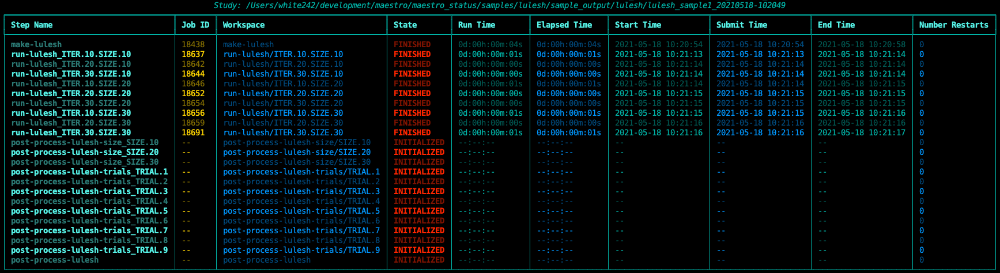
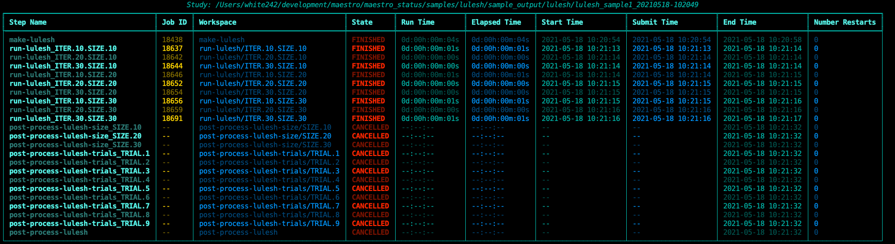
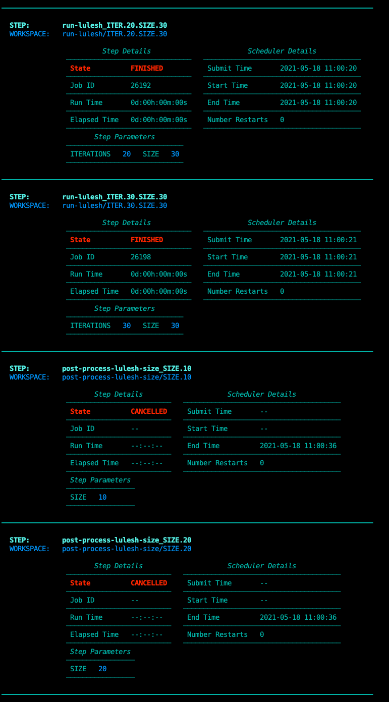

Quick Start Guide
==================

If you haven't already done so, see installation instructions in :doc:`Getting Started <./getting_started>`. For this guide, you will need to checkout `Maestro via GitHub <https://github.com/LLNL/maestrowf>`_ in order to use the provided samples.

Running the LULESH Study
*************************

This section will take you through the basics of using Maestro to launch a study locally. If you're looking for a more detailed breakdown of the LULESH study, skip to the :doc:`LULESH Specification Breakdown <./lulesh_breakdown>`.

`LULESH <https://github.com/LLNL/LULESH>`_ (Livermore Unstructured Lagrangian Explicit Shock Hydrodynamics) is a proxy application developed and open sourced by Lawrence Livermore National Laboratory. The application is capable of being compiled for both serial and distributed execution and provides a simple stand-in for an actual simulation code.

The LULESH study comes in two flavors: one for Unix systems and one for MacOSX systems. Both specifications are just about identical save for minor differences in ``sed`` commands. Simply pick the version for your system. In order to execute the LULESH sample study, execute the following command using Maestro from the root of the repository (using the Unix version as an example)::

    $ maestro run ./samples/lulesh/lulesh_sample1_unix.yaml -o ./tests/lulesh

.. note:: The ``-o`` flag is used for specifying a custom output path. Normally, Maestro creates a timestamped folder each time it is executed. The use of the ``-o`` is used here for consistency with provided logging.

Maestro begins by loading the specification and checks out a copy of LULESH from GitHub::

    2018-08-07 00:58:56,887 - maestrowf.maestro:setup_logging:360 - INFO - INFO Logging Level -- Enabled
    2018-08-07 00:58:56,887 - maestrowf.maestro:setup_logging:361 - WARNING - WARNING Logging Level -- Enabled
    2018-08-07 00:58:56,887 - maestrowf.maestro:setup_logging:362 - CRITICAL - CRITICAL Logging Level -- Enabled
    2018-08-07 00:58:56,887 - maestrowf.datastructures.core.study:__init__:195 - INFO - OUTPUT_PATH = /home/travis/build/LLNL/maestrowf/testing/lulesh
    2018-08-07 00:58:56,887 - maestrowf.datastructures.core.study:add_step:298 - INFO - Adding step 'make-lulesh' to study 'lulesh_sample1'...
    2018-08-07 00:58:56,888 - maestrowf.datastructures.core.study:add_step:298 - INFO - Adding step 'run-lulesh' to study 'lulesh_sample1'...
    2018-08-07 00:58:56,888 - maestrowf.datastructures.core.study:add_step:307 - INFO - run-lulesh is dependent on make-lulesh. Creating edge (make-lulesh, run-lulesh)...
    2018-08-07 00:58:56,888 - maestrowf.datastructures.core.study:add_step:298 - INFO - Adding step 'post-process-lulesh' to study 'lulesh_sample1'...
    2018-08-07 00:58:56,888 - maestrowf.datastructures.core.study:add_step:307 - INFO - post-process-lulesh is dependent on run-lulesh_*. Creating edge (run-lulesh_*, post-process-lulesh)...
    2018-08-07 00:58:56,889 - maestrowf.datastructures.core.study:add_step:298 - INFO - Adding step 'post-process-lulesh-trials' to study 'lulesh_sample1'...
    2018-08-07 00:58:56,889 - maestrowf.datastructures.core.study:add_step:307 - INFO - post-process-lulesh-trials is dependent on run-lulesh_*. Creating edge (run-lulesh_*, post-process-lulesh-trials)...
    2018-08-07 00:58:56,889 - maestrowf.datastructures.core.study:add_step:298 - INFO - Adding step 'post-process-lulesh-size' to study 'lulesh_sample1'...
    2018-08-07 00:58:56,889 - maestrowf.datastructures.core.study:add_step:307 - INFO - post-process-lulesh-size is dependent on run-lulesh_*. Creating edge (run-lulesh_*, post-process-lulesh-size)...
    2018-08-07 00:58:56,890 - maestrowf.datastructures.core.study:setup_workspace:337 - INFO - Setting up study workspace in '/home/travis/build/LLNL/maestrowf/testing/lulesh'
    2018-08-07 00:58:56,890 - maestrowf.datastructures.core.study:setup_environment:347 - INFO - Environment is setting up.
    2018-08-07 00:58:56,890 - maestrowf.datastructures.core.studyenvironment:acquire_environment:191 - INFO - Acquiring dependencies
    2018-08-07 00:58:56,890 - maestrowf.datastructures.core.studyenvironment:acquire_environment:193 - INFO - Acquiring -- LULESH
    2018-08-07 00:58:56,890 - maestrowf.datastructures.environment.gitdependency:acquire:150 - INFO - Cloning LULESH from https://github.com/LLNL/LULESH.git...
    Cloning into '/home/travis/build/LLNL/maestrowf/testing/lulesh/LULESH'...
    remote: Counting objects: 64, done.
    remote: Compressing objects: 100% (40/40), done.
    remote: Total 64 (delta 10), reused 43 (delta 6), pack-reused 16
    Unpacking objects: 100% (64/64), done.
    2018-08-07 00:58:57,306 - maestrowf.datastructures.core.study:configure_study:382 - INFO -
    ------------------------------------------
    Output path =               /home/travis/build/LLNL/maestrowf/testing/lulesh
    Submission attempts =       1
    Submission restart limit =  1
    Submission throttle limit = 0
    Use temporary directory =   False
    ------------------------------------------
    2018-08-07 00:58:57,307 - maestrowf.datastructures.core.executiongraph:__init__:337 - INFO -
    ------------------------------------------
    Submission attempts =       1
    Submission throttle limit = 0
    Use temporary directory =   False
    Tmp Dir =
    ------------------------------------------

Once set up is complete, Maestro will begin expanding the `Study` graph into an ``ExecutionGraph``. The ``ExecutionGraph`` represents the complete execution plan for a study. The snippets below show some of the expected output which will be a mix of single steps and parameterized steps.

Singular steps (such as "make-lulesh") appear in the log as follows::

   2018-08-07 00:58:57,307 - maestrowf.datastructures.core.study:_stage_parameterized:431 - INFO -
    ==================================================
    Processing step 'make-lulesh'
    ==================================================
    2018-08-07 00:58:57,308 - maestrowf.datastructures.core.study:_stage_parameterized:503 - INFO -
    -------------------------------------------------
    Adding step 'make-lulesh' (No parameters used)
    -------------------------------------------------
    2018-08-07 00:58:57,308 - maestrowf.datastructures.core.study:_stage_parameterized:518 - INFO - Searching for workspaces...
    cmd = cd /home/travis/build/LLNL/maestrowf/testing/lulesh/LULESH
    sed -i 's/^CXX = $(MPICXX)/CXX = $(SERCXX)/' ./Makefile
    sed -i 's/^CXXFLAGS = -g -O3 -fopenmp/#CXXFLAGS = -g -O3 -fopenmp/' ./Makefile
    sed -i 's/^#LDFLAGS = -g -O3/LDFLAGS = -g -O3/' ./Makefile
    sed -i 's/^LDFLAGS = -g -O3 -fopenmp/#LDFLAGS = -g -O3 -fopenmp/' ./Makefile
    sed -i 's/^#CXXFLAGS = -g -O3 -I/CXXFLAGS = -g -O3 -I/' ./Makefile
    make clean
    make

Parameterized steps (such as "run-lulesh") appear by printing out their expansion such as in the snippet below. Each combination is printed as it is expanded, for each combination in the ``global.parameters`` section of the study based on the parameters the given step uses::

    2018-08-07 00:58:57,308 - maestrowf.datastructures.core.study:_stage_parameterized:431 - INFO -
    ==================================================
    Processing step 'run-lulesh'
    ==================================================
    2018-08-07 00:58:57,308 - maestrowf.datastructures.core.study:_stage_parameterized:571 - INFO -
    ==================================================
    Expanding step 'run-lulesh'
    ==================================================
    -------- Used Parameters --------
    set(['SIZE', 'ITERATIONS'])
    ---------------------------------
    2018-08-07 00:58:57,308 - maestrowf.datastructures.core.study:_stage_parameterized:578 - INFO -
    **********************************
    Combo [SIZE.10.TRIAL.1.ITER.10]
    **********************************
    2018-08-07 00:58:57,309 - maestrowf.datastructures.core.study:_stage_parameterized:599 - INFO - Searching for workspaces...
    cmd = /home/travis/build/LLNL/maestrowf/testing/lulesh/LULESH/lulesh2.0 -s 10 -i 10 -p > SIZE.10.ITER.10.log
    2018-08-07 00:58:57,309 - maestrowf.datastructures.core.study:_stage_parameterized:630 - INFO - New cmd = /home/travis/build/LLNL/maestrowf/testing/lulesh/LULESH/lulesh2.0 -s 10 -i 10 -p > SIZE.10.ITER.10.log
    2018-08-07 00:58:57,309 - maestrowf.datastructures.core.study:_stage_parameterized:640 - INFO - Processing regular dependencies.
    2018-08-07 00:58:57,309 - maestrowf.datastructures.core.study:_stage_parameterized:648 - INFO - Adding edge (make-lulesh, run-lulesh_ITER.10.SIZE.10)...
    2018-08-07 00:58:57,309 - maestrowf.datastructures.core.study:_stage_parameterized:578 - INFO -
    **********************************
    Combo [SIZE.10.TRIAL.2.ITER.20]
    **********************************
    2018-08-07 00:58:57,309 - maestrowf.datastructures.core.study:_stage_parameterized:599 - INFO - Searching for workspaces...
    cmd = /home/travis/build/LLNL/maestrowf/testing/lulesh/LULESH/lulesh2.0 -s 10 -i 20 -p > SIZE.10.ITER.20.log
    2018-08-07 00:58:57,309 - maestrowf.datastructures.core.study:_stage_parameterized:630 - INFO - New cmd = /home/travis/build/LLNL/maestrowf/testing/lulesh/LULESH/lulesh2.0 -s 10 -i 20 -p > SIZE.10.ITER.20.log
    2018-08-07 00:58:57,309 - maestrowf.datastructures.core.study:_stage_parameterized:640 - INFO - Processing regular dependencies.
    2018-08-07 00:58:57,310 - maestrowf.datastructures.core.study:_stage_parameterized:648 - INFO - Adding edge (make-lulesh, run-lulesh_ITER.20.SIZE.10)...

Once expansion is complete, Maestro will prompt you to confirm if you'd like to launch the study. Simply confirm with a `y` and hit enter.::

    $ Would you like to launch the study? [yn] y

Maestro will launch a conductor in the background using ``nohup`` in order to monitor the executing study.

Monitoring a Running Study
***************************

Once the conductor is spun up, you will be returned to the command line prompt. There should now be a ``./tests/lulesh`` directory within the root of the repository. This directory represents the executing study's workspace, or where Maestro will place this study's data, logs, and state. For a more in-depth description of the contents of a workspace see the documentation about :doc:`Study Workspaces <./maestro_core>`.

In order to check the status of a running study, use the ``maestro status`` subcommand. The only required parameter to the status command is the path to the running study's workspace. In this case, to find the status of the running study (from the root of the repository) is::

    $ maestro status ./tests/lulesh

The resulting output will look something like below:

The general statuses that are usually encountered are:

    - ``INITIALIZED``: A step that has been generated and is awaiting execution.
    - ``RUNNING``: A step that is currently in progress.
    - ``FINISHED``: A step that has completed successfully.
    - ``FAILED``: A step that during execution encountered a non-zero error code.

  
Cancelling a Running Study
***************************

Similar to checking the status of a running study, cancelling a study uses the ``maestro cancel`` subcommand with the only required parameter being the path to the study workspace. In the case of the LULESH study, cancel the study using the following command from the root of the repository::

    $ maestro cancel ./tests/lulesh

.. note:: Cancelling a study is not instantaneous. The background conductor is a daemon which spins up periodically, so cancellation occurs the next time the conductor returns from sleeping and sees that a cancel has been triggered.

When a study is cancelled, the cancellation is reflected in the status when calling the ``maestro status`` command

Status Layouts
**************

There are currently two layouts for viewing the status.  The default `flat` layout shown above can be a little hard to read in narrow terminals or in studies with long step/parameter combo names.  For this purpose a `narrow` layout has also been implemented,
compressing the width and making the status table taller.  Additionally, the extra room allows the addition of per step tables of parameter names and values.  To switch between these two simply use the `--layout` option with either `flat` or `narrow` as shown below::

  $ maestro status ./tests/lulesh --layout narrow

A snippet of the narrow layout for the above study is shown below.  These layouts are computed by status command, so can alternate between them in the same study without issue:

Note these layouts read some colors from your terminal theme, including the background color.  The red for the state, yellow for jobid and the blue color on alternating columns are currently fixed.  Snapshots reproduced using the encom theme for iTerm2.
