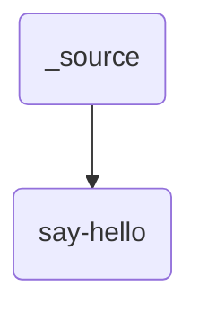
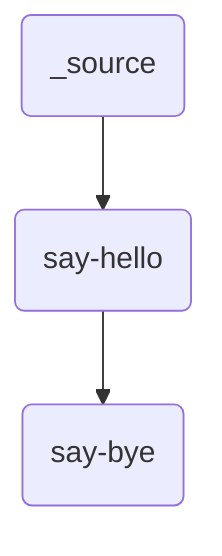

# Tutorials
----

This section will build up a complete example demonstrating the core features of Maestro studies and how to run and interact with them.  These examples can be found in the `samples` directory at the root of the git repository in addition to being copyable directly from the docs.

## Hello World
----

We'll start with a simple linear study, aka no parameters.  Create a `YAML` file named `hello_world.yaml` and start with the two keys that are required to make a runnable study specification: `description` and `study`.  Documentation and repeatability are core features of Maestro, and the description is one of the means of enforcing these.  Two keys are required for the `description` block, `name` and `description`, as shown below:

``` yaml
description:
    name: hello_world
    description: A simple 'Hello World' study.
```

Now that we have the documentation and purpose of the study embedded into it it's time to add something for it to actually do.  This is done via the `study` block, which contains a list of study steps.  We'll use the `-` `YAML` syntax here as each step is a multiline dictionary of sub keys.  As with the study level `description`, each step is required to have a `name` and a `description`.  `name` is a unique identifier here and can be used in references as shown in subsequent examples.  Finally there is the `run` block, which contains at a minimum a `cmd` key which contains the actual shell commands to run.  Currently these are bash only.  We use the `|` `YAML` syntax to denote the following will be multiple lines but all are stored in the `cmd` key:

``` yaml
description:
    name: hello_world
    description: A simple 'Hello World' study.
    
study:
    - name: say-hello
      description: Say hello to the world!
      run:
          cmd: |
            echo "Hello, World!" > hello_world.txt
```

### The `run` command

The `run` subcommand is how you tell Maestro to go and execute this study we've defined:

``` console
maestro run study.yaml
```

There are many additional arguments you can pass to each subcommand, but for this study there is one that is particularly relevant: `sleep`.  By default Maestro will sleep for 60 seconds between checks for submitting new jobs and checking on status of existing jobs.  As most of the studies in the tutorial run very quickly we can adjust this down to ~1s to get faster turnaround.

``` console title="maestro run -h" hl_lines="1 4 14 15"
usage: maestro run [-h] [-a ATTEMPTS] [-r RLIMIT] [-t THROTTLE] [-s SLEEPTIME] [--dry] [-p PGEN] [--pargs PARGS] [-o OUT] [-fg] [--hashws] [-n | -y] [--usetmp] specification

positional arguments:
  specification         The path to a Study YAML specification that will be loaded and executed.

options:
  -h, --help            show this help message and exit
  -a ATTEMPTS, --attempts ATTEMPTS
                        Maximum number of submission attempts before a step is marked as failed. [Default: 1]
  -r RLIMIT, --rlimit RLIMIT
                        Maximum number of restarts allowed when steps. specify a restart command (0 denotes no limit). [Default: 1]
  -t THROTTLE, --throttle THROTTLE
                        Maximum number of inflight jobs allowed to execute simultaneously (0 denotes not throttling). [Default: 0]
  -s SLEEPTIME, --sleeptime SLEEPTIME
                        Amount of time (in seconds) for the manager to wait between job status checks. [Default: 60]
  --dry                 Generate the directory structure and scripts for a study but do not launch it. [Default: False]
  -p PGEN, --pgen PGEN  Path to a Python code file containing a function that returns a custom filled ParameterGenerator instance.
  --pargs PARGS         A string that represents a single argument to pass a custom parameter generation function. Reuse '--parg' to pass multiple arguments. [Use with '--pgen']
  -o OUT, --out OUT     Output path to place study in. [NOTE: overrides OUTPUT_PATH in the specified specification]
  -fg                   Runs the backend conductor in the foreground instead of using nohup. [Default: False]
  --hashws              Enable hashing of subdirectories in parameterized studies (NOTE: breaks commands that use parameter labels to search directories). [Default: False]
  -n, --autono          Automatically answer no to input prompts.
  -y, --autoyes         Automatically answer yes to input prompts.
  --usetmp              Make use of a temporary directory for dumping scripts and other Maestro related files.
```

### Checking the status

After invoking `maestro run hello_world.yaml -s 1` you won't see any output directly.  Looking back at the specification that was written, the "Hello World!" output we are looking for is actually written to a file `hello_world.txt`.  Do an `ls` on your current workspace and you will see Maestro created some new folders when it executed the study.  In this case it will simply be the name of the study, from the `description` block, with a date-timestamp appended to it using an `_`.  To see if anything actually ran, maestro provides a `status` sub command, which takes that `study_name_date-timestamp` directory as the only required argument.  There are some additional layout options you can explore via `maestro status -h`.

``` console
maestro status /path/to/study/output/hello_world_20220712-230235
```


### Outputs

Now let's take a look at what actually got written to that date-timestamped output directory we found.  You will see something similar to the snapshot below:


!!! note

    The output above was generated with the help of the excellent [Rich Library](https://github.com/Textualize/rich), which is also used for rendering the study status.  See the INSERT LINK script if you wish to reproduce the view for your own study workspaces
    
Inside that date-timestamped workspace that contains this instance of the executed study is more than you might expect to get generated for a study who's only output is the "hello_world.txt" that is generated in the actual study step.  Most of this is metadata Maestro needs for generating and running the study (`meta` folder), log files which you can use to debug your studies (see `maestro -h` for debug/log options), the pickle file Maestro creates for managing study data while running, and then finally the workspaces for each of the steps in the study.  In this case we have a single directory with `name` from the specification, combined with error and standard outputs from the executed shell script, the generated output file `hello_world.txt` and the shell script itself `hello_world.sh`.  This last file is one of the more important pieces as it is the shell script as Maestro ran it.  This enables both debugging and verifying pre run (using `--dry` argument to the `run` command), as well as rerunning.  This shell script is runnable as is without Maestro, enabling more rapid debugging and testing of it.  

### `env` block

If you keep launching new instances of this study you will quickly have a whole bunch of `hello_world_date-timestamp` directories cluttering up the local workspace along side where your `hello_world.yaml` study specification is.  Maestro provides a facility to help with this in the optional `env`, or environment block.  In this block, under the `variables` sub-block you can specify an optional `OUTPUT_PATH` variable, which is a special token maestro looks for to generate a parent directory to write all those timestamped study instances to and keep them more organized.  Adding that to our specification, all timestamped directories will now be written into a `samples` directory that is located at the same level as our `hello_world.yaml` study specification.  Note that relative pathing works and is relative to the study specification, but absolute paths can also be used.

``` yaml
description:
    name: hello_world
    description: A simple 'Hello World' study.
   
env:
    variables:
      OUTPUT_PATH: ./samples
      
study:
    - name: say-hello
      description: Say hello to the world!
      run:
          cmd: |
            echo "Hello, World!" > hello_world.txt
```

### Workflow topology

One final detail to note here is the topology of the workflow we have built.  Studies are organized using directed acyclic graphs, or DAG's, and Maestro's input features enable building DAG's with several topologies which we will highlight as we go.  This example uses the simplest, which is a single step, unparameterized (or linear) graph as shown below



Here `_source` has special meaning, and is always the root of the DAG's that define a study.

## Hello, Bye World
----

Now that we've got a taste for what a Maestro specification looks like, how to run it, and what it generates, it's time to look into more interesting workflow topologies.  That was a lot of work for echoing "Hello World", but we now have a framework to build on and do a whole lot more with minimal extra work.  A common next step in defining studies and workflows is to add dependent or child steps using the optional `depends` key in study steps' `run` block.  Let's add a second step that says 'good-bye', but we also don't want this to run until after we say 'hello'.  The `depends` key simply takes a list of other step names, which tells Maestro to not run this step until those dependencies have successfully completed.

``` yaml hl_lines="21"
description:
    name: hello_world
    description: A simple 'Hello World' study.
   
env:
    variables:
      OUTPUT_PATH: ./samples
      
study:
    - name: say-hello
      description: Say hello to the world!
      run:
          cmd: |
            echo "Hello, World!" > hello_world.txt
            
    - name: say-bye
      description: Say good bye to the world!
      run:
          cmd: |
            echo "Good-bye, World!" > good_bye_world.txt
          depends: [say-hello]
```

### Toplogy

Now our topology is slightly more interesting:


